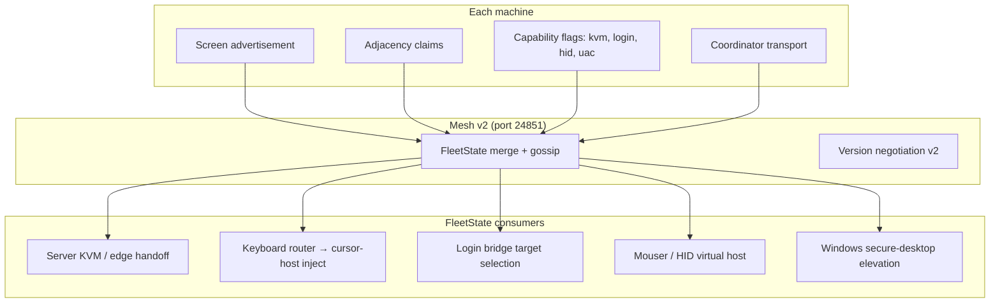

# FleetState hub — mesh v2 day-1 refactor

## What We're Building

A coordinated redesign of Deskflow's multi-machine KVM so the fleet behaves like one linked desk from the first edge cross — not after repeated screen slams or a manual mouse move to "wake up" a connection.

Today three concepts are conflated but not unified:

| Concept | Where it lives today | Problem |
|---------|-------------------|---------|
| **KVM topology** (who is left/right of whom) | Server-only `Config` links from GUI grid | Other machines don't know adjacency; server skips unconnected screens at the edge |
| **Fleet cursor** (which machine holds the pointer) | Deskflow `enter`/`leave` + mesh `cursor` host name | Dual signals; no resync on reconnect; keyboard gate lags |
| **Coordination** (who is server, election) | Mesh v1 on port 24851 | Wire-compatible with legacy; no topology or capability sync |

The refactor introduces **mesh protocol v2** centered on a replicated **`FleetState`** model. Each peer advertises its screen shape and adjacency claims; the fleet merges them into a shared graph. **Cursor-host inject** becomes the single keyboard path: every machine forwards physical keys to whichever host holds the fleet cursor, and that host synthesizes locally. **Server KVM, keyboard relay, login bridge, Mouser, and Windows secure-desktop** all consume the same FleetState instead of maintaining parallel partial truths.

Success feels like: link machines once → topology is fleet-known → move to an edge once → handoff is immediate → type on any keyboard → text appears on the cursor host → login-window and HID features follow the same cursor routing.

## Why This Approach

Three architectural options were considered:

**FleetState hub (chosen)** — One replicated state object (topology fragments, cursor host + position, elected server, peer capabilities). `Coordinator` becomes transport + reconciler; subsystems read/write FleetState only.

**Capability plugins** — Typed mesh messages per subsystem (kvm, keyboard, login, hid). More modular but scatters the "what is true right now?" question across plugins; harder to reason about instant handoff.

**Incremental v2 shell** — Ship version negotiation + topology first, fold other features later. Lower first-ship risk but delays the unified keyboard/login/HID story the user wants in v1.

FleetState hub wins because the primary pain is **inconsistent partial state** across machines, not missing features. One hub lets us fix edge slam, keyboard follow, and login-bridge targeting with the same cursor/topology truth.

## Key Decisions

| Decision | Choice | Rationale |
|----------|--------|-----------|
| Primary goals | Instant handoff + unified fleet state + clean layer boundaries | All three; accept larger refactor |
| Mesh compatibility | **Versioned break (v2)** | Fleet upgrades together; update kvmctl; no legacy wire shackles |
| Topology authority | **Peer merge** | Each machine advertises screen shape + adjacency claims; fleet builds graph collaboratively (decentralized, matches multi-Mac fleet) |
| Keyboard routing | **Cursor-host inject** | Every machine forwards keys to cursor host; host synthesizes (clean up today's dual client/server paths) |
| V1 scope | **Everything (one vision, stacked delivery)** | All subsystems consume FleetState before fleet cutover; ship as sequential PRs on one branch, not one monolithic commit |
| Architecture | **FleetState hub** | Single replicated model; subsystems are consumers |
| Topology conflicts | **Elected server tie-break** | When peer adjacency claims disagree, elected server's claims win; GUI shows conflict badge |
| FleetState storage | **In-memory + mesh gossip** | No disk persistence in v1; optional snapshot is a follow-up if reboot recovery is needed |

## Target Architecture



### FleetState (conceptual fields)

| Field | Source | Consumers |
|-------|--------|-----------|
| `peers[]` | Peer merge | Connection pre-warm, reconciler |
| `screens[name]` | Local platform + advertisement | Topology merge, enter coords |
| `links[]` | Adjacency claims merged | Edge neighbor lookup (all machines) |
| `cursor.host` | Server epoch + enter/leave | Keyboard inject target |
| `cursor.screen` | Active Deskflow screen name | Relay gate |
| `cursor.pos` | Optional normalized position | Login bridge, smoother handoff |
| `role.server` | Election (existing semantics, v2-encoded) | Epoch loop |
| `capabilities[name]` | Per-peer flags | Login bridge, HID seize, UAC |

### Layer cleanup (day-1 boundaries)

| Layer | Owns | Must not own |
|-------|------|--------------|
| `coordination/` | Mesh v2 codec, FleetState merge, election, keyboard forward transport | TIS/layout, screen injection |
| `server/` | Deskflow protocol, `switchScreen`, `m_active` | Mesh topology authority |
| `platform/` | OS injection, CGEventTap, Karabiner bridge I/O | Fleet election rules |
| `gui/` | Layout editing → **advertisement + claims** (not server-only truth) | Runtime handoff |

Remove today's leaks: `Server` importing `CoordinationProtocol` key phases; coordination importing `KeyTypes`; keyboard relay duplicating platform TIS logic.

### Mesh v2 wire (sketch — planning phase details)

- Handshake: `{ "t": "hello", "v": 2, "caps": [...] }` — reject v1 peers in pure-v2 mode (configurable mixed window for dev only).
- State sync: `{ "t": "state", "fragment": { ... } }` — merge into FleetState.
- Retain election **semantics** (touch-to-promote, cooldowns, burst debounce) but encode as FleetState role fields, not ad-hoc message types.
- Keyboard: `{ "t": "key", "to": "<cursor_host>", "phase": ... }` — replaces `keyfwd` ad-hoc path.
- Deprecate standalone `cursor` message — cursor is a FleetState field updated on every handoff.

### Instant handoff (fixes edge slam)

Root causes addressed by FleetState hub:

1. **Pre-connect** — When topology merge shows linked peers, client epoch opens TCP to server before edge hit.
2. **Enter resync** — On client connect, if FleetState says cursor is on that screen, server sends `enter()` immediately (`Server::adoptClient` fix).
3. **Fleet-known neighbors** — Edge lookup uses merged `links[]`, not only local server config; disconnected neighbor → queue switch on `ScreenConnected`.
4. **Switch gating audit** — Defaults reviewed (`enableSwitchDelay`, double-tap, jump zone); fleet policy can disable friction.

### Keyboard (cursor-host inject, unified)

Single path:

```
Physical key on any machine
  → KeyboardRouter (client or server epoch — same API)
  → if cursor.host == self → synthesize locally
  → else mesh v2 key message → cursor.host → synthesize
```

Eliminate: `PrimaryClient` swallowing relayed keys; separate server KeyState vs client relay divergence; `cursorHere` vs mesh `cursor` dual signals (both become FleetState.cursor).

### Login bridge, Mouser, HID, Windows UAC

All read **FleetState.cursor.host** and **capabilities** instead of bespoke peer lists:

- **Login bridge** — server candidates from FleetState peers with `cap_kvm`; scale/geometry from advertised screen shape.
- **Mouser/HID** — virtual host attach when FleetState says cursor is remote; seize rules from capability flags.
- **Windows secure desktop** — auto-elevate when FleetState reports secure-desktop capability active on cursor host (extends existing watchdog pattern).

## Implementation phasing (stacked PRs, one branch)

V1 means **all success criteria pass before fleet cutover**, not a single PR. Recommended merge order:

| Phase | Delivers | Unblocks |
|-------|----------|----------|
| **P0 — Interim hotfixes (current mesh v1)** | `adoptClient` enter resync, pre-connect peers, switch-gating audit | Immediate edge-slam relief while v2 builds |
| **P1 — Mesh v2 shell** | Version handshake, FleetState struct, merge engine, dual listener (dev only) | Protocol foundation |
| **P2 — Topology peer merge** | Screen ads + adjacency claims → merged `links[]`; GUI status shows fleet graph | Instant handoff (with v1 keyboard still) |
| **P3 — Handoff integration** | Server reads merged topology; pre-connect; queued switch on connect | First edge cross works |
| **P4 — Keyboard router** | Unified cursor-host inject; remove dual client/server paths | Fleet keyboard |
| **P5 — Capability consumers** | Login bridge, Mouser/HID, Windows UAC read FleetState | Full v1 soak |
| **P6 — Cutover** | Disable v1 listener; kvmctl v2; coordinated fleet upgrade | Production |

**Hard cutover gate:** no machine disables v1 until P0–P5 pass on hackintosh + macbookpro + tiny11 soak.

## Risks

| Risk | Mitigation |
|------|------------|
| Peer-merge conflicts produce wrong adjacency | Elected server tie-break + GUI conflict indicator; soak with intentional mismatch |
| FleetState divergence after partition | Full-mesh gossip on reconnect; elected server publishes snapshot on promotion |
| Scope creep in P5 | Each consumer reads only `cursor.*` + `capabilities` — no new mesh message types per feature |
| Long-running branch | P0 ships to `master` independently; v2 branch rebases weekly |
| Keyboard latency over mesh | Keys stay small JSON; bulk mouse stays on Deskflow TCP 24800 |

## What We Are Not Doing (YAGNI guardrails)

- **Cloud / central config server** — peer merge stays LAN/Tailscale-local.
- **Replacing Deskflow TCP (24800)** for mouse/keyboard stream — mesh carries state + key events; bulk input stays on Deskflow protocol.
- **Perfect CRDT for v1** — last-writer-wins merge with server tie-break is enough if peer merge conflicts are rare; full CRDT only if planning proves conflicts common.
- **Rewriting GUI grid editor** in v1 — GUI emits advertisements + claims; FleetState merge is runtime. GUI can stay familiar.

## Migration & Rollout

- **Coordinated fleet upgrade** — all machines on mesh v2 before cutover (user accepted versioned break).
- **kvmctl v2** — read FleetState snapshot instead of legacy status JSON.
- **Settings** — new keys: `coordination/meshVersion=2`, optional `coordination/fleetId` for token scoping.
- **Dev mixed mode** — optional v1 listener for one release; default off.

## Open Questions (for `/plan`)

1. **Cursor position granularity** — Normalized (x,y) on active screen for login bridge in P5, or screen name only until post-v1?
2. **Mixed-version window** — Hard cut only, or one-release dual listener on port 24852 for soak?
3. **Test matrix** — Confirm hackintosh + macbookpro + tiny11 as minimum soak fleet.
4. **P0 hotfix branch** — Land on `master` before v2 branch splits, or include in v2 branch only?

## Related Docs & Code

| Resource | Relevance |
|----------|-----------|
| `docs/coordination/design.md` | Current epoch loop, election, mesh v1 |
| `docs/coordination/behavior-spec.md` | Election semantics to preserve |
| `docs/plan/2026-06-30-fix-fleet-keyboard-handoff-still-failing-plan.md` | Immediate keyboard bugs (some fixed on branch) |
| `src/lib/coordination/` | Refactor target |
| `src/lib/server/Server.cpp` | adoptClient, edge handoff |
| `src/apps/deskflow-vhid-bridge/` | Login bridge consumer |

## Success Criteria (soak)

- [ ] Link three machines once; all show consistent topology in status UI
- [ ] First edge cross to any linked neighbor succeeds without repeated slam
- [ ] Type on slave with cursor on server local screen → appears on server (no mouse move first)
- [ ] Type on server with cursor on remote → appears on remote
- [ ] Role flip (auto promotion) → handoff works within one edge cross after epoch settles
- [ ] Login-window control from elected server after logout
- [ ] Mouser gesture on remote cursor host works without manual re-enter
- [ ] Windows UAC prompt clickable from remote while secure desktop active
