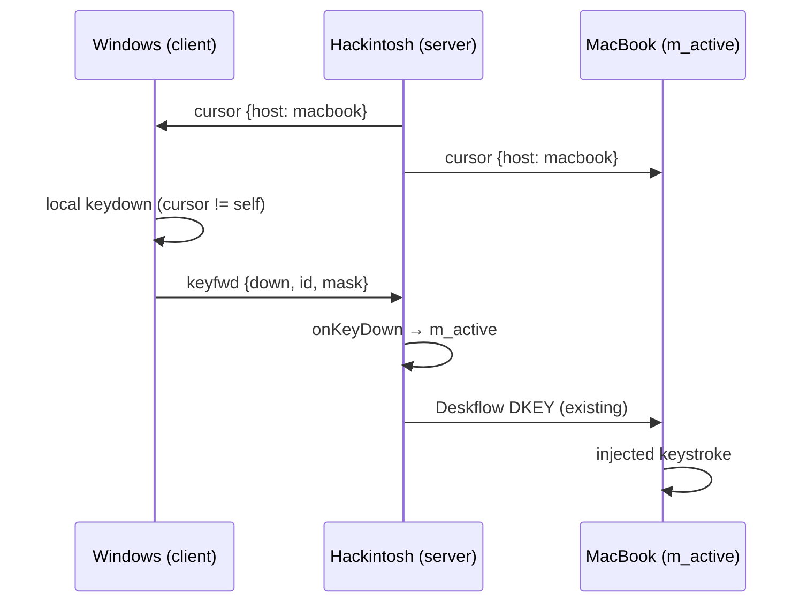

---
vgv_next:
  skill: build
  artifact: docs/plan/2026-06-30-feat-fleet-keyboard-follow-cursor-plan.md
title: feat fleet keyboard follow-cursor
type: feat
date: 2026-06-30
---

## feat fleet keyboard follow-cursor — Standard

## Overview

In **auto-switch mode** (3+ peers), forward physical keyboard input from any machine to whichever machine currently holds the **fleet cursor**. Keys typed on the machine that has the cursor stay local. Keyboard activity must **not** change server promotion (mouse/touch only).

Brainstorm: [`docs/brainstorm/2026-06-30-fleet-keyboard-follow-cursor-brainstorm-doc.md`](../brainstorm/2026-06-30-fleet-keyboard-follow-cursor-brainstorm-doc.md)

## Problem Statement / Motivation

| Today | Desired |
|-------|---------|
| Only the **server epoch** captures keyboard; `Server::onKeyDown` routes to `m_active` | Any peer can contribute keyboard when cursor is elsewhere |
| Clients ignore local keys except for **promotion** via `ILocalInputMonitor` | Clients forward keys to server without calling `ElectionState::onLocalInput()` |
| User must physically use the server machine's keyboard to type on remote screen | Type on MacBook while cursor is on Hackintosh → text lands on Hackintosh |

## Proposed Solution

Extend the **coordination mesh** (port 24851, newline JSON) with cursor broadcast + key forward messages. Server remains authoritative for cursor host and reuses existing Deskflow injection (`m_active`).



### Phase 1 — Protocol + settings

| Task | File(s) | Change |
|------|---------|--------|
| P1.1 | `CoordinationProtocol.h/.cpp` | Add `Message::Type::Cursor`, `KeyFwd`; `encodeCursor`, `encodeKeyFwd`, decode fields |
| P1.2 | `docs/coordination/behavior-spec.md` | Document `cursor` + `keyfwd` (note: extends legacy wire; kvmctl unaffected) |
| P1.3 | `Settings.h`, `SettingsTests.cpp` | Add `coordination/keyboardFollowCursor` (bool, default `true` in auto mode) |
| P1.4 | `CoordinationProtocol` unit tests | Round-trip encode/decode; reject bad token |

**Wire shapes (v1):**

```json
{"t":"cursor","host":"<screen-name>","seq":42,"token":"<shared>"}
{"t":"keyfwd","from":"<sender>","phase":"down|up|repeat","id":65543,"mask":8,"button":0,"lang":"","token":"<shared>"}
```

### Phase 2 — Server cursor broadcast

| Task | File(s) | Change |
|------|---------|--------|
| P2.1 | `Coordinator.h/.cpp` | `broadcastCursor(host)`; cache `m_cursorHost`; expose `cursorHost()` thread-safe |
| P2.2 | `ServerApp.cpp` or `AutoModeRunner.cpp` | On `EventTypes::ServerScreenSwitched`, call `broadcastCursor(activeScreenName)` |
| P2.2b | `Coordinator::workerLoop` | Re-broadcast cursor every ~3 s on server heartbeat tick (covers missed events) |
| P2.3 | `Coordinator::onMessage` | Handle inbound `keyfwd`: validate sender ∈ peers, map to `KeyID`, invoke server key handler |

**Server key injection hook:** Add `Coordinator::setKeyForwardHandler(std::function<void(KeyFwdEvent)>)` registered by `ServerApp` during server epoch so coordination layer does not link to `Server` directly.

### Phase 3 — Client keyboard relay (non-promoting)

| Task | File(s) | Change |
|------|---------|--------|
| P3.1 | `LocalInputMonitor.h` | New `IKeyboardRelayMonitor` interface — **key events with phase/id/mask**, separate from promotion tap |
| P3.2 | `OSXKeyboardRelayMonitor.mm` (new) | CGEventTap listen-only; on key down/up/repeat: if `cursorHost != self` → `encodeKeyFwd` to server address; else **return event unmodified** (local OS) |
| P3.3 | `MSWindowsKeyboardRelayMonitor.cpp` (new) | Low-level keyboard hook or Raw Input keyboard path; same forward-when-not-local rule |
| P3.4 | `StubLocalInputMonitor.cpp` | Stub relay (no-op) for unsupported platforms |
| P3.5 | `Coordinator.cpp` | Start/stop relay monitor when `keyboardFollowCursor` enabled; **never** call `onGenuineInput()` from relay |

**Critical separation:** Existing `OSXLocalInputMonitor` counts mouse **and** keys for promotion. Relay monitor handles **keys only** and excludes them from promotion (per brainstorm decision).

### Phase 4 — Server epoch local keyboard

When server has cursor on a **remote** client, existing `Server::onKeyDown` → `m_active` already works. When cursor returns to server primary screen, local keys stay on server. **No double-send:** relay monitor on server epoch should no-op when `role == Server` and keys are already captured by `Server`'s primary input path — or disable relay on server epoch entirely (simplest v1).

**Recommendation (v1):** Run relay **only during client epoch**. Server epoch uses existing capture only.

### Phase 5 — Safety & epoch transitions

| Task | File(s) | Change |
|------|---------|--------|
| P5.1 | `Server::switchScreen`, role flip | On `m_active` change mid-stream, synthesize key-up for tracked keys (reuse `leaveSecondary` / `KeyState` cleanup patterns) |
| P5.2 | `AutoModeRunner.cpp` | On epoch end, relay `releaseAllKeys()` to server if forwarding |
| P5.3 | `Coordinator.cpp` | Ignore `keyfwd` when sender role unknown or token bad; rate-limit per sender |

### Phase 6 — Login screen (defer if blocked)

| Task | Notes |
|------|-------|
| P6.1 | If cursor on login Mac via bridge, verify `keyfwd` → server → client injection reaches `deskflow-vhid-bridge` |
| P6.2 | If not, add bridge-side listener or route `keyfwd` to bridge TCP port — **only after desktop path proven** |

## Technical Considerations

### Files to touch (summary)

```
src/lib/coordination/
  CoordinationProtocol.h/.cpp      # new message types
  Coordinator.h/.cpp               # cursor broadcast, keyfwd dispatch
  LocalInputMonitor.h              # split promotion vs relay
  OSXLocalInputMonitor.mm          # optionally exclude keys from promotion counter
  OSXKeyboardRelayMonitor.mm       # NEW
  MSWindowsKeyboardRelayMonitor.cpp # NEW
  CMakeLists.txt

src/apps/deskflow-core/
  AutoModeRunner.cpp               # wire ServerScreenSwitched → broadcastCursor

src/lib/deskflow/
  ServerApp.cpp                    # register keyForwardHandler with Coordinator

src/lib/common/
  Settings.h                       # keyboardFollowCursor key

src/unittests/coordination/
  CoordinationProtocolTests.cpp    # NEW
  CoordinatorKeyFwdTests.cpp       # NEW (mock handler)

docs/coordination/behavior-spec.md
```

### Modifier / layout translation

Reuse existing client-side translation in `ServerProxy::keyDown` (`translateKey`, `translateModifierMask`) — server forwards raw `KeyID`/`KeyModifierMask`; injection path already handles OS mapping on destination.

### Promotion isolation

`OSXLocalInputMonitor` currently fires on all genuine events. Options:

1. **(Recommended)** Remove `kCGEventKeyDown/Up` from promotion tap mask; promotion = mouse/touch only.
2. Relay uses a second tap — higher complexity, two Input Monitoring consumers.

Aligns with brainstorm: **typing never promotes**.

### Security

- Require `coordination/token` on `keyfwd` (same as `claim`).
- Accept `keyfwd` only from configured peer names.
- Log dropped/forged messages at debug.

### kvmctl compatibility

New message types are ignored by legacy tooling (unknown `t` → skip). Document in behavior-spec §2.

## Acceptance Criteria

- [ ] 3-machine auto cluster: type on non-cursor machine → characters appear on cursor machine
- [ ] Type on cursor machine → local app receives input (no forward)
- [ ] Keyboard does not trigger server promotion or epoch churn (mouse promotion still works)
- [ ] Server switch / screen switch releases stuck modifiers (no ghost keys)
- [ ] Setting `coordination/keyboardFollowCursor=false` disables relay
- [ ] Unit tests: protocol round-trip, forward-when-not-local decision, token rejection

## Test Plan

### Automated

- `CoordinationProtocolTests`: encode/decode `cursor`, `keyfwd`
- `CoordinatorTests`: mock mesh; server receives `keyfwd`, handler invoked once
- `ElectionStateTests`: verify keyboard relay callback does **not** call `onLocalInput`

### Manual (3-machine soak)

1. Hackintosh + MacBook + Windows, all `deskflow-core auto`, shared token/peers
2. Move cursor to MacBook (mouse on Hackintosh server)
3. Type on Windows → verify text in MacBook foreground app
4. Type on MacBook → verify local MacBook app receives keys
5. Move cursor to Hackintosh; type on MacBook → verify Hackintosh receives keys
6. Rapid server promotion via mouse only; confirm no keyboard-induced flapping
7. Hold Shift on Windows, type on MacBook destination — modifier behaves correctly

## Out of Scope (v1)

- GUI toggle (settings key only)
- Keyboard broadcast to multiple screens
- Typing-to-promote
- Per-monitor mesh granularity beyond Deskflow screen names

## Open Questions (resolve in build if needed)

1. **macOS promotion tap:** Confirm removing keys from promotion tap does not break touch-to-promote on keyboard-only users (acceptable trade-off per brainstorm).
2. **Windows relay API:** Raw Input vs low-level hook — match permission model (no new admin).
3. **Repeat keys:** Forward OS repeat events vs server-side resynthesis — prefer forward native repeat from relay tap.
