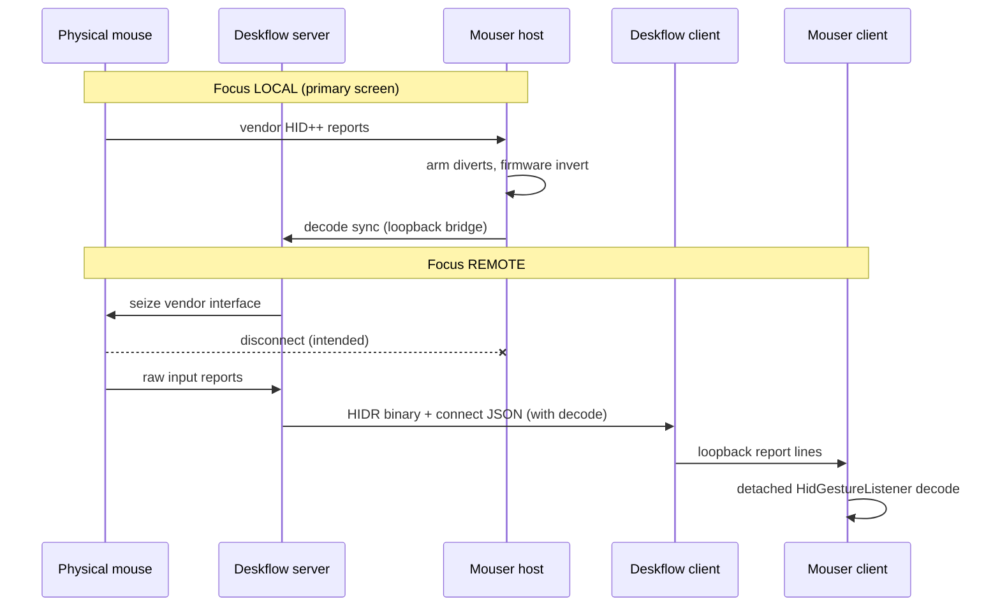

## feat: native mouse handoff via Deskflow HID passthrough — Standard

## Overview

Ship a production-ready cross-machine Logitech mouse workflow where **vendor
HID++ events (gestures, thumb button, SmartShift, DPI)** follow KVM focus
through Deskflow, execute natively on the focused machine's Mouser instance,
and are **physically suppressed on the host** while focus is remote — without
merging the two codebases or building semantic gesture vocabulary into Deskflow.

Deskflow owns transport and host-side seize. Mouser stays a local HID++
consumer on each machine. Estimated Mouser diff for v1: **~25 lines** across
`config.py`, `remote_forward.py`, and `engine.py`.

## Problem Statement / Motivation

### User pain

- One physical Logitech mouse shared across Hackintosh, MacBook, and Windows via Deskflow KVM.
- Gestures (Mission Control swipes, thumb button) only work on the machine where Mouser has the device.
- When focus moves, either gestures fire on the wrong machine, or host Mouser intercepts before Deskflow can relay.
- Firmware scroll-wheel invert must apply **per machine** without double-invert.
- External Python/Swift/C# supervisor scripts are fragile; everything should live in Deskflow.

### Why not full Mouser relay on the host?

The existing `remote_forward` path suppresses handling via
`should_forward()` in `mouse_hook_base.py`, but the host Mouser still holds the
hidapi handle. Logitech Options+ and divert state can race. **Physical seize**
of the vendor interface (Deskflow `HidPassthrough`) is cleaner: host Mouser
observes a disconnect and cannot fire gestures at all.

## Proposed Solution

### Primary path: HID passthrough (recommended)



### Fallback path: Mouser bridge only

For Linux host (stub grabber) or debugging:

- Host Mouser `remote_forward` relays decoded events or raw reports via `DMSR`.
- Suppression is logical (`should_forward()` in `mouse_hook_base.py`).
- Do **not** run alongside HID passthrough (Deskflow already warns on conflict).

### Decode context handoff (P0 blocker)

`HidPassthrough::connectLineFor()` (`src/lib/server/HidPassthrough.cpp:176`)
emits PID/name/usage but not `decode`. Remote `remote_device._build_raw_decoder()`
(`Mouser/core/remote_device.py:341`) **rejects raw frames without `feat_idx`**.

**Chosen approach (Option A):** Host Mouser publishes live decode context to
`MouserBridge` while focus is local; `Server` merges cached decode into
`m_hidConnectLine` before relaying to the focused client.

Rationale: `feat_idx` is discovered at runtime when diverts arm
(`hid_gesture.py:2537`); catalog lookup alone is insufficient for receivers
and multi-interface devices.

## Technical Considerations

### Architecture impacts

| Layer | File(s) | Change |
|---|---|---|
| Deskflow decode cache | `Server.h`, `Server.cpp`, `MouserBridge.cpp` | Accept `{"type":"decode",...}`; store `m_hidDecodeJson`; merge into connect line in `updateHidVirtualHost` / `handleHidPassthroughEvent` |
| Deskflow connect builder | `HidPassthrough.cpp` | `connectLineWithDecode(descriptor, decode)` helper |
| Mouser decode-only mode | `config.py`, `remote_forward.py`, `engine.py` | `passthrough_decode_only: true` → connect to bridge, emit decode updates, never `send_event`/`send_report` |
| Mutual exclusion | `Server.cpp`, `SettingsDialog.cpp` | Passthrough + full bridge relay = hard error or auto-disable event relay |
| Coordination | `src/lib/coordination/*` | Orthogonal; `auto` mode composes but does not block passthrough |

### Performance implications

- Hot path: binary `HIDR` frames (`kMsgDHidReport` in `ProtocolTypes.cpp`).
- Decode sync: JSON line on device connect / `feat_idx` change only (cold path).
- Loopback sockets: existing `MouserBridge` / `MouserClient` thread model.

### Security considerations

- Loopback-only listeners; token auth on both local hops (existing posture in `docs/mouser-bridge.md`).
- No generic input injection — allowlisted event vocabulary on bridge fallback only.
- Raw frames are opaque bytes; remote decoder is pluggable (Mouser today).

### Fail-safe guarantees (must not regress)

From `docs/hid-passthrough.md`:

| Situation | Host seize? | Host Mouser |
|---|---|---|
| Deskflow off | never | normal |
| Passthrough off | never | normal |
| Focus local | no | normal |
| Focus remote | yes | disconnect (intended) |
| Deskflow crash | OS releases seize | re-acquires |

## User Flow Analysis

### Happy paths

1. **Daily use — focus on remote**
   - User moves cursor to MacBook → Deskflow seizes vendor interface on Hackintosh.
   - Gesture swipe on MX Master → decoded on MacBook Mouser → Mission Control fires there.
   - Host Mouser silent (device disconnected).

2. **Return to host**
   - Cursor returns to Hackintosh → seize released → host Mouser reconnects.
   - `_run_saved_settings_replay` in `engine.py` restores firmware invert / diverts.

3. **Per-machine wheel invert**
   - Each Mouser has independent invert settings.
   - Only one machine holds vendor interface → no double-invert.

### Edge cases identified

| Edge case | Expected behavior | Owner |
|---|---|---|
| Host Mouser starts after Deskflow | Reconnect loop; decode published on `feat_idx` ready | Mouser `remote_forward._run` |
| Focus flips before `feat_idx` known | Remote connect sent without decode; raw frames dropped until decode arrives; re-send connect with decode | Deskflow `Server` |
| Physical device unplug mid-remote | `HidPassthrough` detach → disconnect to client; host Mouser stays disconnected until replug + focus local | Deskflow grabber |
| Remote Mouser not running | Pointer works via normal KVM; vendor buttons absent (acceptable) | — |
| Both passthrough + full bridge enabled | Refuse start or auto-disable event relay; log clear error | Deskflow P1 |
| `auto` mode role flip during remote focus | Passthrough seize tied to `m_active != m_primaryClient`; survives epoch if server role retained | Deskflow coordination |
| macOS TCC not granted | `deskflow-core` fails assistive check; document ad-hoc sign + grant steps | Ops / docs |
| Linux host | Stub grabber → use bridge fallback until P2 | Deskflow P2 |

### Configuration mistakes (user-facing)

| Mistake | Symptom | Fix |
|---|---|---|
| Token mismatch | Bridge hello rejected | Align `mouserBridgeToken` / `mouserToken` / Mouser config tokens |
| `remote_forward` full relay + passthrough | Duplicate/conflicting paths | Enable `passthrough_decode_only` on host |
| `remote_device` on host | Unnecessary listener | Host: `remote_device.enabled=false` |
| Missing `hidPassthroughDevices` | Passthrough starts but matches nothing | Set `046D:PID` (e.g. `046D:B042` for MX Master 4) |

## Acceptance Criteria

### P0 — Decode handoff (ship blocker)

- [ ] Host Mouser with `passthrough_decode_only: true` connects to `MouserBridge` and sends `{"type":"decode","feat_idx":N,"gesture_cid":"0x....",...}` when `gesture_decode_context()` becomes available.
- [ ] Host Mouser in decode-only mode **never** sends `event` or `report` lines.
- [ ] `Server::handleMouserBridgeLine` caches decode JSON separately from `m_mouserConnectLine`.
- [ ] `m_hidConnectLine` sent to focused client includes merged `device.decode` object.
- [ ] Remote Mouser decodes a gesture swipe from raw `report` frames without manual `settings.remote_device.decode`.
- [ ] Unit tests: Deskflow decode merge; Mouser decode-only gating.

### P1 — Polish

- [ ] Passthrough + full bridge relay mutually excluded with clear GUI message.
- [ ] Tray status shows active passthrough device name and target screen.
- [ ] `docs/mouser-bridge.md` updated with decode-only host mode.

### P2 — Linux host grabber

- [ ] `LinuxHidGrabber` via hidraw exclusive or `EVIOCGRAB` on vendor collection.
- [ ] Fail-safe table holds on Linux.

### P3 — Live validation

- [ ] Hackintosh + MacBook: gesture swipes fire on remote only.
- [ ] Firmware wheel invert correct per machine on focus return.
- [ ] Kill `deskflow-core` mid-remote → host Mouser recovers within 2s.
- [ ] `auto` mode + passthrough: touch-to-promote does not break seize logic.

### P4 — Packaging (later)

- [ ] `mouseflow` repo: submodules, `cluster.yaml`, installers, docs.

## Implementation Tasks

### Phase 1 — Decode handoff (Deskflow)

**Branch:** `feat/native-mouse-handoff` off `master`

1. **`Server.h` / `Server.cpp`**
   - Add `QJsonObject m_hidDecodeCache` (or `std::string`).
   - In `handleMouserBridgeLine`: handle `type == "decode"` → update cache; do not relay to clients.
   - Add `std::string buildHidConnectLine()` that merges `m_hidConnectLine` base device JSON with cached decode.
   - Use `buildHidConnectLine()` in `handleHidPassthroughEvent` (Attach) and `updateHidVirtualHost`.

2. **`HidPassthrough.cpp`**
   - Optionally accept decode injection via `Server` callback rather than building decode here (keeps passthrough device-agnostic).

3. **Unit test** (`src/unittests/server/` or extend existing)
   - JSON merge: device + decode → valid connect line.

### Phase 2 — Decode-only forwarder (Mouser)

**Branch:** merge to `working` from `feat/remote-raw-frames`

1. **`core/config.py`** (~5 lines)
   - Add `"passthrough_decode_only": false` under `settings.remote_forward`.

2. **`core/remote_forward.py`** (~15 lines)
   - Constructor flag `decode_only`.
   - `send_event` / `send_report`: no-op when `decode_only`.
   - `notify_decode_changed()`: send `{"type":"decode",...}` when `feat_idx` appears or changes.
   - Session loop: poll decode supplier periodically or on device connect callback.

3. **`core/engine.py`** (~5 lines)
   - Pass `decode_only=fwd_cfg.get("passthrough_decode_only", False)` to `RemoteForwarder`.
   - After HID ready / `feat_idx` known, call `notify_decode_changed()`.

4. **Tests** (`tests/test_remote_forward.py`)
   - `test_decode_only_never_sends_events`
   - `test_decode_only_sends_decode_message`

### Phase 3 — Integration test (both repos)

Loopback simulation:

1. Mock `MouserBridge` TCP server accepts decode + focus messages.
2. `RemoteForwarder(decode_only=True)` publishes decode.
3. `RemoteDeviceServer` receives connect with decode + report frame → gesture dispatch.

### Phase 4 — Live soak checklist

```text
[ ] deskflow-core ad-hoc signed; Accessibility + Input Monitoring granted
[ ] Host: hidPassthroughEnabled=true, hidPassthroughDevices=046D:<PID>
[ ] Host Mouser: remote_forward.enabled=true, passthrough_decode_only=true
[ ] Remote Mouser: remote_device.enabled=true
[ ] Focus remote → verify host [HidGesture] disconnect log
[ ] Swipe gesture on remote → Mission Control / configured action fires
[ ] Focus local → host invert + gestures restore
[ ] killall deskflow-core → host Mouser reconnects
```

## Configuration Reference

### Host (mouse physically attached)

`~/Library/Application Support/Deskflow/deskflow.conf`:

```ini
[server]
hidPassthroughEnabled=true
hidPassthroughDevices=046D:B042
mouserBridgeEnabled=true
mouserBridgePort=19796
mouserBridgeToken=<secret>
```

Mouser `config.json`:

```json
"remote_forward": {
  "enabled": true,
  "token": "<secret>",
  "passthrough_decode_only": true
},
"remote_device": { "enabled": false }
```

### Remote (focused client)

```ini
[client]
mouserEnabled=true
mouserPort=19795
mouserToken=<secret>
```

```json
"remote_device": { "enabled": true, "token": "<secret>" },
"remote_forward": { "enabled": false }
```

## Success Metrics

| Metric | Target |
|---|---|
| Gesture fires on wrong machine | 0 in 30-min soak |
| Double scroll invert | 0 across focus transitions |
| Host Mouser fires gesture while focus remote | 0 (physical disconnect) |
| Decode handoff without manual `remote_device.decode` | 100% for supported devices |
| Deskflow crash recovery | Host Mouser re-acquires < 2s |

## Dependencies & Risks

| Risk | Likelihood | Mitigation |
|---|---|---|
| `feat_idx` not ready before first remote focus | Medium | Re-send connect when decode arrives; document "wait for HID ready" |
| macOS TCC / codesign identity drift | High (seen in field) | Document stable ad-hoc identifier; build/install task |
| Passthrough + bridge misconfiguration | Medium | P1 mutual exclusion |
| Linux no grabber | Certain until P2 | Document bridge fallback |
| Receiver PID vs device PID mismatch | Low | HID++ name query already in `hid_gesture.py`; decode from host ground truth |

## References & Research

### Institutional docs (deskflow fork)

- `docs/hid-passthrough.md` — seize model, wire protocol, fail-safe table
- `docs/mouser-bridge.md` — loopback bridge, DMSR relay, settings
- `docs/coordination/design.md` — auto mode, epoch loop (orthogonal)

### Key code paths

| Path | Role |
|---|---|
| `src/lib/server/HidPassthrough.cpp:169` | Focus-driven seize |
| `src/lib/server/Server.cpp:505` | `updateHidVirtualHost` on screen switch |
| `src/lib/server/Server.cpp:532` | `handleMouserBridgeLine` |
| `src/lib/client/ServerProxy.cpp:867` | `hidReport` → MouserClient |
| `Mouser/core/remote_device.py:341` | `_build_raw_decoder` |
| `Mouser/core/remote_forward.py:104` | `should_forward` |
| `Mouser/core/mouse_hook_base.py:142` | `_should_intercept_events` |
| `Mouser/core/hid_gesture.py:2262` | `decode_context()` |

### Existing tests to extend

- `Mouser/tests/test_remote_raw_frames.py`
- `Mouser/tests/test_remote_forward.py`
- `Mouser/tests/test_remote_end_to_end.py`

### Prior informal plan

- Superseded by this document: `docs/plan/native-mouse-handoff.md`

## Non-Goals

- Merging Mouser into Deskflow
- Kernel filter drivers / Tier-2 virtual HID reinjection (future)
- Semantic `gesture_down` vocabulary in Deskflow long-term
- Teleporting pointer/clicks (Deskflow KVM already handles this)
