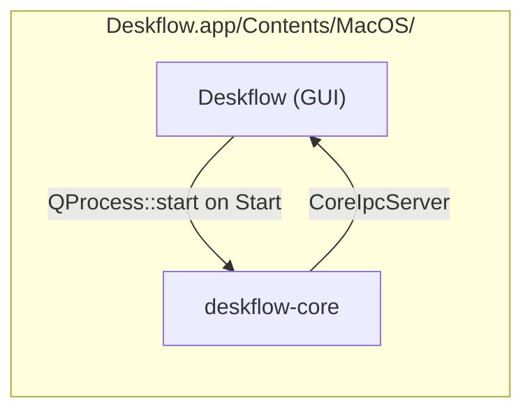

---
vgv_next:
  skill: build
  artifact: docs/plan/2026-06-30-feat-vscode-macos-deskflow-launcher-plan.md
title: "feat: VS Code macOS launcher for Deskflow GUI and deskflow-core"
type: feat
date: 2026-06-30
---

## feat: VS Code macOS launcher for Deskflow GUI and deskflow-core — Standard

## Overview

Improve the Cursor/VS Code developer launcher so macOS builds behave like the
installed app: **Deskflow** (GUI) is the primary entry point, **deskflow-core**
is spawned from the same bundle when the user presses **Start**, and both
binaries remain **separate debug/run targets** for focused PRs. Release install
(`/Applications/Deskflow.app` via `scripts/install-macos.sh`) stays unchanged.

## Problem Statement / Motivation

### User pain

- Unclear whether to debug **Deskflow** or **deskflow-core** — they are separate
  binaries but production always runs GUI → core.
- Current `launch.json` has two debug configs but no **Run tasks**, hardcoded
  `client` args on core-only launch, and no guidance on conflicts with an
  installed `/Applications` copy.
- Default build task is **Release + install**; F5 uses **Debug + `build-debug/`**
  — easy to mix up.
- When debugging GUI, spawned core runs **outside** the debugger unless attach
  or compound launch is configured.

### Architecture (how it actually works)



| Component | Role | macOS path |
|-----------|------|------------|
| **Deskflow** (`Deskflow.app`) | Qt GUI, settings, tray, Start/Stop | `build[-debug]/bin/Deskflow.app` |
| **deskflow-core** | Server/client/auto KVM engine | `…/Deskflow.app/Contents/MacOS/deskflow-core` |
| **CoreProcess** | Resolves core as `applicationDirPath() + "/deskflow-core"` | `src/lib/gui/core/CoreProcess.cpp:106` |
| **install-macos.sh** | Release → `/Applications`, `open --args --show` | `scripts/install-macos.sh` |

**Key behavior:** GUI does **not** auto-start core on launch unless
`Settings::Gui::AutoStartCore` is true and mode prerequisites pass
(`MainWindow.cpp` ~758–763). Pressing **Start** calls `startCore()` →
`CoreProcess::start()` → `QProcess::start(m_appPath, args)`.

**PR separation:** GUI and core are separate CMake targets
(`src/apps/deskflow-gui/`, `src/apps/deskflow-core/`) and can land as
independent PRs to upstream `deskflow/deskflow`, even though macOS bundles both
into one `.app`.

## Proposed Solution

### Design principle: mirror production, debug separately

| Workflow | Launcher target | Core starts how |
|----------|-----------------|-----------------|
| **Daily dev (default)** | Deskflow GUI | User presses **Start** (or AutoStartCore) — same as installed app |
| **Core-only PR** | deskflow-core | Direct launch with mode args; no GUI |
| **Full smoke test** | Build, Sign & Install | Release install to `/Applications` |

Do **not** auto-spawn core from the launcher on GUI F5 — that diverges from
production and hides GUI onboarding (Accessibility gate, settings save).

### 1. VS Code tasks (Run, not only Debug)

Add tasks alongside existing Release pipeline in `.vscode/tasks.json`:

| Task label | Purpose |
|------------|---------|
| `Deskflow: Run GUI (Debug, local)` | `open build-debug/bin/Deskflow.app --args --show` — no install, native macOS launch |
| `Deskflow: Run Core (Debug, client)` | Run `deskflow-core client` from debug bundle |
| `Deskflow: Run Core (Debug, server)` | Run `deskflow-core server` from debug bundle |
| `Deskflow: Run Core (Debug, auto)` | Run `deskflow-core auto` from debug bundle |
| `Deskflow: Quit all (macOS)` | Mirror `install-macos.sh` quit patterns — stop GUI, core, vhid-bridge before debug |

Keep existing:

- `Build, Sign & Install Deskflow` (Release, default build)
- `Deskflow: Configure (Debug) + Build` (preLaunchTask for F5)

### 2. Launch configurations

Update `.vscode/launch.json`:

**Deskflow GUI (macOS Debug)** — primary F5 config

```json
{
  "name": "Deskflow GUI (macOS Debug)",
  "type": "lldb",
  "request": "launch",
  "program": "${workspaceFolder}/build-debug/bin/Deskflow.app/Contents/MacOS/Deskflow",
  "args": ["--show"],
  "cwd": "${workspaceFolder}",
  "preLaunchTask": "Deskflow: Configure (Debug) + Build"
}
```

Use explicit `Contents/MacOS/Deskflow` path for CodeLLDB reliability.

**deskflow-core (macOS Debug)** — parameterized variants

Replace hardcoded `client` with **inputs** or separate configs per mode:

- `deskflow-core (Debug, client)`
- `deskflow-core (Debug, server)`
- `deskflow-core (Debug, auto)`

Each reads settings from `~/Library/Deskflow/Deskflow.conf` (default) unless
`--config` is passed.

**Optional follow-up: Attach to spawned core**

```json
{
  "name": "Attach to deskflow-core",
  "type": "lldb",
  "request": "attach",
  "pid": "${command:pickProcess}"
}
```

Document: Start GUI under debug → press Start → attach to `deskflow-core` PID
for full-stack breakpoints without compound-launch complexity.

### 3. Build directory contract

| Directory | Build type | Used by |
|-----------|------------|---------|
| `build/` | Release | Install script, daily installed app |
| `build-debug/` | Debug | F5, Run GUI/Core tasks |

Never install Debug over `/Applications` by default. Optional stretch:
`DESKFLOW_INSTALL_APP=~/Applications/Deskflow-Debug.app` for side-by-side testing.

### 4. Developer runbook (short section in plan / INSTALL.md)

**Before F5:**

1. Quit `/Applications/Deskflow.app` if running (single-instance + SHM on
   `deskflow-core` will block).
2. Grant **Accessibility** to **both** debug GUI and debug core paths in System
   Settings (TCC is per binary path).

**GUI PR workflow:** F5 → GUI config → press Start → verify log line
`running command: …/deskflow-core …`.

**Core PR workflow:** Run Core task or F5 core config → breakpoint in
`src/lib/server/` or `src/lib/client/` — no GUI needed.

**Integration PR (GUI spawns core):** GUI debug + **Attach to deskflow-core**
after Start.

### 5. What we will NOT change

- No CMake changes to bundle layout (core already co-located correctly).
- No change to `CoreProcess` spawn logic.
- No change to `install-macos.sh` Release path.
- No auto-start core from launcher (preserves production parity).

`.vscode/` is gitignored in this fork; document that devs copy or maintain local
`.vscode/` from a tracked template if upstream contribution is desired later
(e.g. `docs/dev/vscode-launcher.example.json`).

## Technical Considerations

### Single-instance conflicts

| Lock | Key | Conflict |
|------|-----|----------|
| GUI | `deskflow-gui` SHM | Second GUI exits; pings first |
| Core | `deskflow-core` SHM | Second core exits unless multi-instance |

`install-macos.sh` kills all Deskflow processes — running it during an active
debug session will terminate the debugger target.

### Shared settings file

Debug and Release both use `~/Library/Deskflow/Deskflow.conf`. Dev experiments
can mutate production config. Optional future: `DESKFLOW_SETTINGS_FILE` env in
launch configs for isolated dev config (only if env is already honored — verify
before adding).

### Orphan core on macOS

Linux sets `PR_SET_PDEATHSIG` when GUI spawns core; macOS does not. Stopping
the GUI debugger may leave `deskflow-core` running. **Quit all** task mitigates.

### Debugger scope

GUI F5 does **not** break in spawned core. Acceptable for GUI PRs; core PRs use
core-only config or attach workflow.

## Acceptance Criteria

### Build & launch infrastructure

- [ ] Fresh clone on macOS: **Deskflow GUI (macOS Debug)** (F5) builds
  `build-debug/` and opens main window with `--show`.
- [ ] **deskflow-core (Debug, client/server/auto)** each launch, hit a
  breakpoint in core source, exit cleanly.
- [ ] **Deskflow: Run GUI (Debug, local)** task opens app without install step.
- [ ] **Deskflow: Quit all (macOS)** stops GUI, core, and vhid-bridge.

### Native behavior parity

- [ ] Debug GUI does **not** auto-start core unless `AutoStartCore` is enabled.
- [ ] Pressing **Start** spawns `build-debug/.../deskflow-core` (log:
  `running command: …`).
- [ ] Stop/Restart from GUI works under debugger.

### Isolation & documentation

- [ ] Runbook documents: quit installed app before debug; TCC per path; shared
  settings file.
- [ ] `build/` Release install path unchanged — no regression to
  `scripts/install-macos.sh`.

### Core-under-debugger workflow

- [ ] Document attach-after-Start for integration debugging.
- [ ] Core launch args match GUI modes (no hardcoded-only `client`).

## Success Metrics

- Developer can F5 GUI and complete Start → connect flow without manual cmake.
- Core-only PR can debug without opening GUI.
- No accidental overwrite of `/Applications` Release app from debug workflow.

## Dependencies & Risks

| Risk | Mitigation |
|------|------------|
| CodeLLDB not installed | `extensions.json` recommends `vadimcn.vscode-lldb` |
| Installed app blocks debug | Quit-all task + runbook |
| Stale core in debug bundle | preLaunchTask always rebuilds |
| `.vscode` gitignored | Optional tracked example under `docs/dev/` for sharing |

## Implementation Tasks

- [ ] Add Run + Quit tasks to `.vscode/tasks.json`
- [ ] Fix GUI `program` path to explicit `Contents/MacOS/Deskflow`
- [ ] Split core launch configs by mode (client/server/auto)
- [ ] Add attach configuration for spawned core
- [ ] Add `docs/dev/MACOS_DEBUG.md` runbook (or section in `INSTALL.md`)
- [ ] Optional: `docs/dev/vscode-launcher.example.json` for git-tracked template

## References & Research

- GUI spawns core: `src/lib/gui/core/CoreProcess.cpp:214-235`
- Core path resolution: `src/lib/gui/core/CoreProcess.cpp:106`
- Start button flow: `src/lib/gui/MainWindow.cpp:488-505`
- AutoStartCore gate: `src/lib/gui/MainWindow.cpp:758-763`
- macOS bundle layout: `src/apps/deskflow-core/CMakeLists.txt:51-56`
- Install + relaunch: `scripts/install-macos.sh:82-90`
- Current launcher: `.vscode/launch.json`, `.vscode/tasks.json`
- Related: mouse-sharing / HID work in `docs/plan/2026-06-30-feat-native-mouse-handoff-plan.md`
