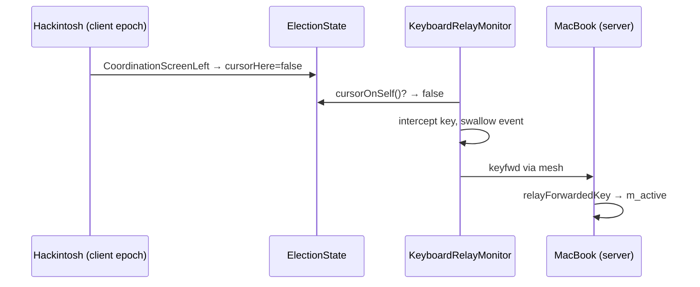

---
vgv_next:
  skill: build
  artifact: docs/plan/2026-06-30-fix-fleet-keyboard-follow-cursor-relay-plan.md
title: fix fleet keyboard follow-cursor relay
type: fix
date: 2026-06-30
---

## fix fleet keyboard follow-cursor relay — Standard

## Overview

Fix fleet keyboard follow-cursor so typing on a **client-epoch** machine reaches the screen under the fleet cursor. The v1 relay gates on `fleetCursorHost` from mesh `cursor` messages, which clients often never receive. Switch the relay decision to **`ElectionState::cursorHere()`**, already maintained via `CoordinationScreenEntered` / `CoordinationScreenLeft` in `AutoModeRunner.cpp`.

Brainstorm: [`docs/brainstorm/2026-06-30-fix-fleet-keyboard-follow-cursor-relay-brainstorm-doc.md`](../brainstorm/2026-06-30-fix-fleet-keyboard-follow-cursor-relay-brainstorm-doc.md)

## Problem Statement / Motivation

| Observed | Expected |
|----------|----------|
| Client relay checks `fleetCursorHost`; empty → keys stay local | Forward keys when cursor is not on this machine |
| Zero `keyfwd` activity in hackintosh logs despite working mouse switches | Typing on hackintosh while cursor on macbook → text on macbook |
| Mesh `cursor` delivery fragile (bare peer names, epoch flips) | Relay works without mesh cursor dependency |

Server-epoch typing to remote screens uses existing `Server::onKeyDown` → `m_active` and is **out of scope** unless manual testing shows it also fails.

## Proposed Solution

Replace the relay's string-based cursor-host query with a boolean **cursor-on-self** query sourced from election state.



### Phase 1 — Interface change

| Task | File(s) | Change |
|------|---------|--------|
| P1.1 | `KeyboardRelayMonitor.h` | Replace `CursorHostQuery` (`std::string`) with `CursorOnSelfQuery` (`bool` returning `true` when cursor is on local screen). Update `start()` signature; drop unused `selfName` param if no longer needed for host comparison. |
| P1.2 | `Coordinator.h/.cpp` | Add `bool cursorOnSelf()` (thread-safe, reads `m_election.cursorHere()` under mutex). Wire relay: `[this] { return cursorOnSelf(); }`. Keep `fleetCursorHost()` / mesh cursor handling unchanged. |
| P1.3 | `StubKeyboardRelayMonitor.cpp` | Match new interface. |

### Phase 2 — Platform relay monitors

| Task | File(s) | Change |
|------|---------|--------|
| P2.1 | `OSXKeyboardRelayMonitor.mm` | Forward when `!cursorOnSelf()`; pass-through when `cursorOnSelf()`. Remove `hostsEqual` / `selfName` comparison. Keep swallow-on-forward (`return nullptr`). |
| P2.2 | `MSWindowsKeyboardRelayMonitor.cpp` | Same logic as macOS. |
| P2.3 | `Coordinator.cpp` `updateKeyboardRelayForRole` | Pass new callback; remove `selfName` arg to `start()` if dropped. |

**Relay rule (v1):**

```cpp
if (cursorOnSelf()) {
  return event; // local OS
}
// forward via sendKeyForward; swallow event
```

### Phase 3 — Initial state / edge cases

| Task | File(s) | Change |
|------|---------|--------|
| P3.1 | `ElectionState.cpp` | Document behavior: `becameClient()` sets `cursorHere=false`. Forwarding enabled until `CoordinationScreenEntered`. Acceptable because cursor-on-remote is the common case when becoming client; server sends `enter()` promptly when cursor is local. |
| P3.2 | (optional, only if soak test fails) | Tri-state `cursorHere` (`Unknown/Here/Away`) — forward only on explicit `Away`. **Do not implement unless manual test shows false-forward at epoch start.** |

### Phase 4 — Observability (minimal, in-code)

| Task | File(s) | Change |
|------|---------|--------|
| P4.1 | `Coordinator.cpp` | `LOG_INFO` once when relay starts on client epoch; `LOG_INFO` on first keyfwd send per epoch (rate-limit or DEBUG for repeats). |
| P4.2 | `Coordinator.cpp` `handleKeyForwardMessage` | `LOG_INFO` on accepted keyfwd (sender name + phase). |

No SSH logging setup; these lines appear in existing file logs when enabled.

## Technical Considerations

### Files to touch

```
src/lib/coordination/
  KeyboardRelayMonitor.h
  KeyboardRelayDecision.h
  Coordinator.h / Coordinator.cpp
  ElectionState.cpp
  OSXKeyboardRelayMonitor.mm
  MSWindowsKeyboardRelayMonitor.cpp
  StubKeyboardRelayMonitor.cpp

src/unittests/coordination/
  ElectionStateTests.cpp
```

### Unchanged

- `AutoModeRunner.cpp` enter/leave wiring (already correct)
- `ServerApp.cpp` cursor broadcast + keyfwd handler
- `Server::relayForwardedKey`
- Mesh `cursor` encode/decode and heartbeat rebroadcast (parallel fleet signal; relay uses `cursorHere()`)
- Promotion tap (mouse-only)

### Out of scope (separate issues)

- **Server-epoch remote typing:** when this machine is server and the cursor is on a remote screen, keys route via `Server::onKeyDown` → `m_active`, not the client relay. Failures there are a different bug.

### Initial-state note

After `becameClient()`, `cursorHere` is `false`. If the cursor is already on the local screen when the client epoch starts, there is a brief window before `Client::enter()` → `CoordinationScreenEntered` where keys could be forwarded incorrectly. Mitigation: server typically sends `enter()` immediately for the active client; validate in soak test. Escalate to tri-state only if reproduced.

### Security

No change to token validation on `keyfwd`. Server still rejects unknown peers.

## Acceptance Criteria

- [ ] On **client epoch**, typing while cursor is on another machine (screen left fired) forwards keys to server and they appear on the active screen.
- [ ] On **client epoch**, typing while cursor is on local machine (screen entered) stays local; no `keyfwd` sent.
- [ ] Keyboard typing does **not** promote server (existing separation preserved).
- [ ] On **server epoch**, relay monitor is stopped; typing with cursor on remote uses existing `m_active` path.
- [ ] `keyboardFollowCursor=false` disables relay (unchanged).
- [ ] Unit tests compile; add or update test for relay decision callback wiring if feasible without platform taps.
- [ ] Build succeeds on macOS (`deskflow-core`).

## Manual test plan (3-machine fleet)

1. Rebuild and reinstall on hackintosh + macbookpro (same commit).
2. MacBook server, cursor on MacBook. Type on Hackintosh (client) → keys must **not** appear on MacBook (local pass-through on Hackintosh if cursor there, or no forward if cursor on MacBook — move cursor to MacBook first, confirm Hackintosh got `ScreenLeft`).
3. Cursor on Hackintosh, type on MacBook (client) → keys appear on Hackintosh.
4. Cursor on MacBook, type on Hackintosh (client) → keys appear on MacBook.
5. Hackintosh promotes to server; cursor on MacBook; type on Hackintosh → keys on MacBook via server primary path.
6. Confirm no `promoting to server (local input burst)` from keyboard alone.
7. **Boot-race check:** become client while cursor is already on the local screen; type immediately — keys must stay local (no `forwarding keyboard to server` log) once `CoordinationScreenEntered` has fired. If keys forward before enter, file a tri-state follow-up.

## PR test plan

Copy steps 1–7 above into the PR description. Expect log lines: `keyboard relay started`, `forwarding keyboard to server` (first key only at INFO), `keyfwd from` (first key only at INFO on server).

## Success Metrics

- Manual soak: 10+ minutes, 3 machines, cursor hops + cross-machine typing works in both directions.
- Log lines show `keyfwd` activity on client-epoch typing (after P4 observability).

## Dependencies & Risks

| Risk | Mitigation |
|------|------------|
| False-forward at client epoch boot | Server `enter()` timing; tri-state fallback if needed |
| Input Monitoring permission denied (macOS) | Existing WARN; document in test plan |
| Server-epoch remote typing still broken | Separate investigation; not blocked by this fix |

## References & Research

- Original feature plan: `docs/plan/2026-06-30-feat-fleet-keyboard-follow-cursor-plan.md`
- Relay gate bug: `OSXKeyboardRelayMonitor.mm:89-93`
- cursorHere wiring: `AutoModeRunner.cpp:108-113`, `ElectionState.cpp:119`
- Log analysis: hackintosh `~/deskflow.log` 2026-07-01 — mouse OK, zero keyfwd
