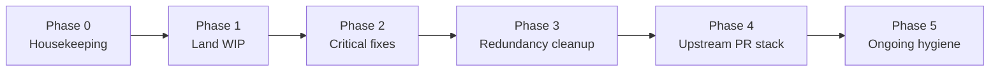

---
vgv_next:
  skill: build
  artifact: docs/plan/2026-06-30-refactor-fork-consolidation-upstream-readiness-plan.md
title: "refactor: fork consolidation and upstream readiness"
type: refactor
date: 2026-06-30
---

## refactor: fork consolidation and upstream readiness — Extensive

## Overview

This plan turns the fork audit (2026-06-30) into an executable roadmap. Local
`master` is **fully merged with `deskflow/deskflow` upstream** (0 commits behind)
but carries **54 fork-specific commits** (~13k lines) with **no upstream PRs
opened yet**, stale feature branches, uncommitted WIP, and known redundancy in
the HID/Mouser/bridge stack.

The work splits into six phases: **housekeeping → land WIP → critical fixes →
redundancy cleanup → upstream PR stack → ongoing hygiene**. Phases 0–2 are
fork-only and can ship this week. Phases 3–4 are larger refactors gated on
design decisions. Phase 5 is recurring process.

## Problem Statement

### Fork state (as of 2026-06-30)

| Signal | Finding |
|--------|---------|
| Upstream sync | ✅ Merged at `6afa46dca`; merge-base `570e68e91` |
| `origin/master` | ⚠️ 2 commits behind local `master` (not pushed) |
| GitHub PRs | ❌ None open on fork or upstream under `hughesyadaddy` |
| Stale branches | `feat/auto-switch`, `feat/mouser-bridge`, `feat/native-coordination`, `claude/karibeener-extension-install-mggwmq` — all superseded by `master` |
| Uncommitted WIP | `.vscode/tasks.json`, GUI/translation tweaks, `docs/dev/*`, `scripts/sync-debug-settings-macos.sh`, cmake/apps changes |
| Docs drift | `INSTALL.md` references wrong branch; 5 overlapping plan docs |
| Code debt | Double `QApplication` in auto mode; duplicated virtual-host logic in `Server.cpp`; HID client path re-encodes to Mouser JSON; three different “bridge” concepts |

### Why this matters

- **Fleet installs** depend on a single coherent `master` — stale branches and
  unpushed commits cause device drift.
- **Upstream contribution** is blocked until the monolith is split into
  reviewable PRs with maintainer buy-in.
- **Redundancy** (Mouser bridge vs HID passthrough) increases bug surface and
  makes every future rebase painful.

## Proposed Solution

Execute phases in order. Each phase ends with a **mergeable commit** (or PR to
fork `master`) and explicit verification. Do not start Phase 4 upstream PRs until
Phase 0–2 are complete and Phase 3 design choices are documented.



## Technical Approach

### Architecture (current fork surface)

| Area | Key paths | Upstreamability |
|------|-----------|-----------------|
| Native coordination | `src/lib/coordination/`, `src/apps/deskflow-core/AutoModeRunner.*` | Needs RFC/discussion |
| Mouser bridge | `src/lib/server/MouserBridge.*`, `src/lib/client/MouserClient.*` | Medium — may deprecate |
| HID passthrough | `src/lib/server/HidPassthrough.*`, `*HidGrabber.*` | Medium — preferred end state |
| macOS login bridge | `src/apps/deskflow-vhid-bridge/`, `LoginBridgeManager.*` | Low — niche |
| Windows vhid + UAC | `src/driver/deskflow-vhid/`, `MSWindowsWatchdog.cpp` | Low — kernel driver |
| GUI auto-switch | `MainWindow.cpp`, `CoordinationStatus.cpp` | Depends on coordination |
| Dev tooling | `.vscode/`, `docs/dev/`, `scripts/install-*.sh` | Fork-only or separate PR |

---

### Phase 0 — Housekeeping (fork hygiene)

**Goal:** One source of truth on `origin/master`; no misleading branches or docs.

**Estimated effort:** 1–2 hours

#### Tasks

- [ ] **Push local `master` to `origin`**
  ```bash
  git push origin master
  ```
- [ ] **Delete stale local and remote branches** (content already in `master`):
  ```bash
  git branch -d feat/native-coordination feat/auto-switch feat/mouser-bridge \
    claude/karibeener-extension-install-mggwmq
  git push origin --delete feat/native-coordination feat/auto-switch \
    feat/mouser-bridge claude/karibeener-extension-install-mggwmq
  ```
- [ ] **Add `build-debug/` to `.gitignore`** (alongside existing `build/` ignores)
- [ ] **Update `INSTALL.md`**
  - Change branch references from `claude/karibeener-extension-install-mggwmq` → `master`
  - Remove Step 0 rebase instructions for the deleted branch
  - Add pointer to `docs/dev/MACOS_DEBUG.md` for local debug workflow
  - Clarify Karabiner login bridge is optional macOS-only (`LoginBridgeManager`), not a core dependency
- [ ] **Create `docs/FORK_ROADMAP.md`** — single index linking:
  - `docs/coordination/*.md`
  - `docs/hid-passthrough.md`, `docs/mouser-bridge.md`
  - `docs/plan/*.md` (mark superseded plans)
  - Upstream PR stack status table (empty initially, updated in Phase 4)

#### Acceptance criteria

- [ ] `git log upstream/master..origin/master` matches local (54 fork commits + merge)
- [ ] `git branch -a` shows only `master` and active work branches
- [ ] `git status` does not list `build-debug/` as untracked
- [ ] `INSTALL.md` clone/checkout instructions use `master`

#### Commit message

`chore: fork hygiene — push master, drop stale branches, fix INSTALL.md`

---

### Phase 1 — Land in-progress WIP

**Goal:** Commit all legitimate uncommitted work; align tracked dev config with examples.

**Estimated effort:** 2–4 hours

#### Current WIP inventory

| File | Action |
|------|--------|
| `.vscode/tasks.json` | Commit (already tracked, skip-worktree `H`) — debug tasks largely complete |
| `.vscode/launch.json` | Gitignored — keep `docs/dev/launch.json.example` as source of truth; document copy step |
| `docs/dev/MACOS_DEBUG.md` | Commit |
| `docs/dev/launch.json.example` | Commit |
| `docs/dev/tasks.json.example` | Commit — mirror committed `.vscode/tasks.json` |
| `scripts/sync-debug-settings-macos.sh` | Commit if tested; else fix or drop |
| `.env.example` | Commit signing/debug env additions |
| `cmake/MacCodesign.cmake` | Commit if related to debug signing |
| `src/apps/CMakeLists.txt` | Review diff — commit only if intentional |
| `src/lib/gui/StyleUtils.h`, `Screen.cpp/h`, `ServerConfigDialog.cpp` | Commit as one GUI polish commit or split |
| `translations/deskflow_*.ts` | Commit with GUI changes (run lupdate if needed) |

#### Tasks

- [ ] **Finish VS Code launcher per** `docs/plan/2026-06-30-feat-vscode-macos-deskflow-launcher-plan.md`:
  - Verify all tasks exist in `.vscode/tasks.json`:
    - `Deskflow: Configure (Debug)`, `Deskflow: Build (Debug)`, `Deskflow: Configure (Debug) + Build`
    - `Deskflow: Prepare Debug Session (macOS)`
    - `Deskflow: Run GUI (Debug, local)`, `Deskflow: Run Core (Debug, client/server/auto)`
    - `Deskflow: Quit all (macOS)`
  - Verify `launch.json` configs match `docs/dev/launch.json.example`
  - Add **README blurb** to `INSTALL.md` § Developer workflow:
    ```bash
    cp docs/dev/launch.json.example .vscode/launch.json   # first time
  - [ ] **Resolve `.vscode` policy:** keep `/.vscode` in `.gitignore` but track `tasks.json` via `git add -f` OR add exception:
    ```
    !.vscode/tasks.json
    !.vscode/launch.json
    ```
    Prefer **tracked examples + optional local copy** to avoid upstream conflict.
- [ ] **Manual smoke test (macOS):**
  1. Run `Deskflow: Quit all (macOS)`
  2. F5 → Deskflow GUI (macOS Debug) → press Start → confirm core spawns
  3. F5 → deskflow-core (Debug, auto) → confirm auto mode starts
  4. Attach to deskflow-core after GUI Start → breakpoint hits in core
- [ ] **Commit in logical chunks:**
  1. `chore(dev): macOS debug launcher tasks, examples, and runbook`
  2. `fix(gui): sharing screen config polish` (if GUI diff is substantive)
  3. `chore(build): codesign and env example updates` (cmake/.env)

#### Acceptance criteria

- [ ] `docs/dev/MACOS_DEBUG.md` documents GUI vs core vs attach workflows
- [ ] Fresh clone + copy examples → F5 works on macOS with CodeLLDB
- [ ] No uncommitted changes except `build-debug/` (ignored)
- [ ] `docs/plan/2026-06-30-feat-vscode-macos-deskflow-launcher-plan.md` acceptance boxes checked or marked done

---

### Phase 2 — Critical fixes (before any upstream PR)

**Goal:** Fix correctness issues that would fail upstream review immediately.

**Estimated effort:** 2–3 hours

#### 2.1 Double `QApplication` in auto mode

**File:** `src/apps/deskflow-core/deskflow-core.cpp`

**Problem:** Lines 78 and 125 each construct `QApplication app(argc, argv)`; the
inner shadows the outer in auto mode.

**Fix:**

```cpp
// deskflow-core.cpp — auto mode branch
if (parser.autoMode()) {
  AutoModeRunner runner(events, processName);
  const auto ipcServer = new deskflow::core::ipc::CoreIpcServer(&app);
  // ... use existing `app` from line 78
}
```

Remove lines 125–126 (second `QApplication` construction). Keep single
`setApplicationName` before first `QApplication app(argc, argv)`.

- [ ] Implement fix
- [ ] Run `deskflow-core auto` — verify no crash on start/stop/role flip
- [ ] Add note in commit body referencing SIGTRAP/epoch teardown stability

#### 2.2 `Server.cpp` env-var TODO (optional quick win)

**File:** `src/lib/server/Server.cpp` ~line 1966 — `DESKFLOW_MOUSE_ADJUSTMENT` env var.

- [ ] Either move to `Settings::Server::*` or add `// fork: tracked in #TBD` comment and defer

#### Acceptance criteria

- [ ] `deskflow-core.cpp` has exactly one `QApplication` instance
- [ ] Auto mode: start → promote → flip role → quit — no Qt warnings on stderr
- [ ] Existing unit tests pass (`ElectionStateTests`, `HidPassthroughTests`, `CoordinationProtocolTests`)

#### Commit message

`fix(core): remove shadowed QApplication in auto mode`

---

### Phase 3 — Redundancy cleanup

**Goal:** Reduce duplication before splitting upstream PRs; align implementation
with `docs/hid-passthrough.md` design intent.

**Estimated effort:** 1–2 weeks (can split into sub-PRs on fork)

#### 3.1 Extract `VirtualHostTracker` from `Server.cpp`

**Problem:** `updateMouserVirtualHost` and `updateHidVirtualHost` (~80 lines
each) duplicate focus-follow connect/disconnect logic.

**New files:**

- `src/lib/server/VirtualHostTracker.h`
- `src/lib/server/VirtualHostTracker.cpp`

**API sketch:**

```cpp
class VirtualHostTracker {
public:
  void onFocusChange(BaseClientProxy *dst, BaseClientProxy *primary,
                     const std::string &connectLine,
                     std::function<void(BaseClientProxy*, const std::string&)> send);
  void disconnect();
private:
  BaseClientProxy *m_host = nullptr;
  std::string m_connectLine;
};
```

**Files to modify:**

- `src/lib/server/Server.h` — replace `m_mouserVirtualHost` / `m_hidVirtualHost` with two trackers or one parameterized instance
- `src/lib/server/Server.cpp` — delegate `updateMouserVirtualHost`, `updateHidVirtualHost`
- `src/lib/server/CMakeLists.txt` — add new sources

- [ ] Implement `VirtualHostTracker`
- [ ] Unit test: focus A→B→primary disconnect/connect sequence
- [ ] No behavior change — regression test with Mouser + HID passthrough enabled

#### 3.2 Tier Mouser bridge as decode-sync helper

**Problem:** UI marks gesture sharing as “legacy Mouser bridge” but runtime
allows both; docs say HID passthrough is the end state.

**Files:**

- `src/lib/gui/dialogs/ServerConfigDialog.cpp` — when HID passthrough enabled, auto-disable Mouser bridge toggle OR show helper text “Mouser bridge used only for decode sync”
- `src/lib/server/Server.cpp` `initHidPassthrough()` — document the dual-path
- `docs/hid-passthrough.md` — add “Mouser bridge dependency” section

**Decision (pick one):**

| Option | Behavior |
|--------|----------|
| **A (Recommended)** | HID passthrough auto-enables minimal Mouser bridge internally for decode sync; hide separate toggle when passthrough on |
| **B** | Keep both toggles; improve mutual-exclusion UX only |
| **C** | Remove Mouser bridge entirely once HID path is consumer-agnostic |

- [ ] Implement Option A
- [ ] Update `ServerConfigDialog.ui` labels
- [ ] Sync translations

#### 3.3 Client-side HID consumer path (decouple from Mouser JSON)

**Problem:** `ServerProxy::hidReport()` re-encodes raw frames to Mouser JSON
(`src/lib/client/ServerProxy.cpp:867–888`), contradicting device-agnostic design.

**Approach:**

1. Add `HidConsumer` interface (loopback TCP or in-process callback)
2. `ServerProxy::hidReport()` delivers raw bytes to `HidConsumer` when configured
3. `MouserClient` implements `HidConsumer` for backward compatibility
4. Settings: `client/hidConsumer` = `mouser` | `none` (future: `native`)

**Files:**

- `src/lib/client/HidConsumer.h` (new)
- `src/lib/client/ServerProxy.cpp`, `ServerProxy.h`
- `src/lib/client/MouserClient.cpp` — implement consumer interface
- `src/lib/common/Settings.h` — new keys
- `src/unittests/client/HidConsumerTests.cpp` (new)

- [ ] Implement interface + Mouser adapter
- [ ] Default remains Mouser for existing users
- [ ] Update `docs/hid-passthrough.md` client section

#### 3.4 Rename macOS login bridge binary (clarity)

**Problem:** `deskflow-vhid-bridge` means three different things.

**Scope (fork-only rename — defer upstream):**

| Current | Proposed |
|---------|----------|
| `src/apps/deskflow-vhid-bridge/` (macOS) | `deskflow-login-bridge` |
| `deskflow-vhid-bridge-win` | keep (Windows IOCTL bridge) |
| `MouserBridge` | keep (protocol name) |

**Files:** `src/apps/CMakeLists.txt`, `LoginBridgeManager.cpp`, `scripts/install-macos.sh`, docs

- [ ] Rename target + update install scripts
- [ ] Add compatibility symlink or launchd label migration note in `docs/coordination/migration.md`

#### 3.5 macOS vhid-bridge protocol reuse (stretch)

**Problem:** `deskflow-vhid-bridge.cpp` (~973 lines) reimplements client protocol.

**Approach:** Link against `deskflow/client` libraries; extract shared framing from `ClientApp` where possible. **Defer** if high risk — document as tech debt in `docs/FORK_ROADMAP.md`.

#### Acceptance criteria (Phase 3)

- [ ] `Server.cpp` virtual-host logic ≤ 50 lines (delegated to tracker)
- [ ] HID passthrough + auto-switch smoke test passes on macOS fleet
- [ ] `ServerProxy::hidReport` has test coverage for raw delivery path
- [ ] No user-visible regression in Mouser gesture relay

---

### Phase 4 — Upstream PR stack

**Goal:** Split 54 commits into reviewable PRs to `deskflow/deskflow` in
dependency order. **Open a discussion issue first** before large features.

**Estimated effort:** Ongoing (weeks)

#### 4.0 Pre-flight

- [ ] Open **GitHub Discussion** on `deskflow/deskflow`:
  - Title: “RFC: native auto-switch coordination + HID device passthrough”
  - Link: `docs/coordination/design.md`, `docs/hid-passthrough.md`, `docs/auto-switch-design.md`
  - Ask: appetite for in-process role election, HID seize, fork-specific login bridge
- [ ] Create tracking table in `docs/FORK_ROADMAP.md`

#### 4.1 PR stack (recommended order)

| PR | Branch | Commits / scope | Target | Blocked by |
|----|--------|-----------------|--------|------------|
| **PR-1** | `fix/posix-recursive-mutex` | `2b188e045` | upstream | — |
| **PR-2** | `fix/macos-poll-active-group` | `4b1463720` | upstream | — |
| **PR-3** | `fix/arch-worker-exceptions` | `972dfdc9c` | upstream | — |
| **PR-4** | `fix/client-connect-logging` | `11d6f0b2e` | upstream | — |
| **PR-5** | `fix/core-qapplication-auto` | Phase 2 fix | upstream | Phase 2 |
| **PR-6** | `feat/mouser-bridge` | `3a1df98dd` + fixes | upstream | Discussion |
| **PR-7** | `feat/hid-passthrough-tier1` | `32f8eb947` + grabbers + GUI | upstream | PR-6 or deprecate 6 |
| **PR-8** | `feat/coordination-core` | `656cd1d16`, `1f515aaca`, election tests | upstream | Discussion |
| **PR-9** | `feat/auto-mode-gui` | GUI auto-switch commits | upstream | PR-8 |
| **PR-10** | `feat/macos-onboarding` | Accessibility gate, SMAppService | upstream | — |
| **fork/infra** | `fork/build-install-scripts` | `scripts/install-*`, signing, `.env` | **fork only** | — |
| **fork/login-bridge** | `fork/macos-login-bridge` | Karabiner bridge | **fork only** unless requested | PR-8 |
| **fork/win-vhid** | `fork/windows-vhid-uac` | driver + watchdog | **fork only** unless requested | PR-8 |

#### Per-PR workflow

```bash
git fetch upstream
git checkout -b fix/posix-recursive-mutex upstream/master
git cherry-pick 2b188e045
# run tests, push to fork, gh pr create --repo deskflow/deskflow --base master
```

- [ ] For each PR: rebase onto latest `upstream/master` before opening
- [ ] Keep PR description ≤ 400 lines; link design doc section
- [ ] Run MCP `very-good-cli` tests where applicable; C++ uses existing unittest targets

#### Fork-only policy

Keep on `hughesyadaddy/deskflow` master (not upstream):

- `scripts/install-macos.sh`, `install-windows.ps1`, `build-windows.ps1`
- `.env.example`, `docs/building-signed.md`, fleet `INSTALL.md` extras
- `docs/dev/*` debug launcher
- macOS Karabiner login bridge (until upstream asks)
- Windows kernel vhid driver (until upstream asks)

#### Acceptance criteria

- [ ] At least PR-1 through PR-4 opened and green CI on upstream
- [ ] Discussion issue has maintainer response before PR-8
- [ ] `docs/FORK_ROADMAP.md` tracks each PR status (open/merged/declined)

---

### Phase 5 — Ongoing upstream hygiene

**Goal:** Prevent re-accumulation of monolith drift.

#### Weekly ritual

```bash
git fetch upstream
git checkout master
git merge --ff-only upstream/master
git push origin master
# Rebase active PR branches: git rebase upstream/master
```

#### Pre-push hook alignment

- Rely on `scripts/hooks/prepush.mjs` for format/analyze
- Before fleet deploy: `bash scripts/install-macos.sh` from clean Release build

#### Branch naming for new work

| Prefix | Use |
|--------|-----|
| `fix/` | Upstreamable bug fixes |
| `feat/` | Upstreamable features |
| `fork/` | Fork-only infra |
| `chore/` | Docs, tooling, hygiene |

#### Acceptance criteria

- [ ] `master` never more than 1 week behind `upstream/master`
- [ ] No long-lived feature branches > 2 weeks without PR or delete
- [ ] New features start from `upstream/master`, not stale fork tip

---

## Alternative Approaches Considered

| Approach | Why rejected |
|----------|--------------|
| Single 13k-line upstream PR | Will not be reviewed; high rejection risk |
| Stay fork-only forever | Loses upstream bug fixes and community; maintenance burden |
| Remove Mouser bridge immediately | Breaks existing gesture workflow before HID consumer path exists |
| Track `.vscode/` in upstream | Upstream gitignores it; use `docs/dev/*.example` instead |

## Acceptance Criteria (global)

### Functional

- [ ] Fleet can `git pull origin master && bash scripts/install-macos.sh` on all devices
- [ ] Auto-switch + HID passthrough work on macOS/Windows production paths
- [ ] Debug launcher supports GUI, core-only, and attach workflows

### Non-functional

- [ ] No shadowed `QApplication`; no duplicate virtual-host logic in `Server.cpp` after Phase 3
- [ ] `build-debug/` never committed
- [ ] Design docs match implementation (HID consumer path documented)

### Quality gates

- [ ] `ElectionStateTests`, `CoordinationProtocolTests`, `HidPassthroughTests` pass
- [ ] Manual smoke: GUI Start → core spawn → role flip → quit
- [ ] `INSTALL.md` and `docs/FORK_ROADMAP.md` accurate

## Success Metrics

| Metric | Target |
|--------|--------|
| Commits ahead of upstream on `master` | Decrease as PRs merge (track in roadmap) |
| Open upstream PRs from fork | ≥ 4 bug-fix PRs within 2 weeks of Phase 4 start |
| Stale branches | 0 |
| `Server.cpp` fork-specific LOC | −30% after VirtualHostTracker |
| Time to debug GUI+core issue | < 5 min with attach workflow |

## Dependencies & Prerequisites

- GitHub access to `hughesyadaddy/deskflow` and permission to open PRs on `deskflow/deskflow`
- macOS: CodeLLDB, Qt 6.7+, codesign identity in `.env`
- Fleet devices on `master` for install script testing
- Maintainer engagement for PR-6+ (discussion issue)

## Risk Analysis & Mitigation

| Risk | Impact | Mitigation |
|------|--------|------------|
| Upstream rejects coordination feature | Large fork-only delta remains | Ship fork/infra; keep modular boundaries |
| HID seize breaks on OS update | Gestures stop working | Platform-specific tests; grabber isolation |
| Cherry-pick conflicts during PR split | Delayed upstream contribution | Start with isolated bug-fix PRs |
| Renaming login bridge breaks launchd | Login screen injection fails | Migration script in `LoginBridgeManager` |
| `.vscode` gitignore vs tracked tasks | Contributor confusion | Document in `INSTALL.md` + examples |

## Documentation Plan

| File | Update |
|------|--------|
| `INSTALL.md` | Phase 0 — master branch, debug workflow |
| `docs/FORK_ROADMAP.md` | New — PR tracker + doc index |
| `docs/dev/MACOS_DEBUG.md` | Phase 1 — commit |
| `docs/hid-passthrough.md` | Phase 3 — Mouser dependency, client consumer |
| `docs/coordination/migration.md` | Phase 3.4 — login bridge rename |
| `docs/plan/2026-06-30-feat-vscode-macos-deskflow-launcher-plan.md` | Mark complete after Phase 1 |

## References & Research

### Internal

- Upstream merge: `6afa46dca`
- Double QApplication: `src/apps/deskflow-core/deskflow-core.cpp:78,125`
- Virtual host duplication: `src/lib/server/Server.cpp:594–689`
- HID re-encode: `src/lib/client/ServerProxy.cpp:867–888`
- Core spawn path: `src/lib/gui/core/CoreProcess.cpp:106`
- Coordination design: `docs/coordination/design.md`
- HID design: `docs/hid-passthrough.md`
- VS Code launcher plan: `docs/plan/2026-06-30-feat-vscode-macos-deskflow-launcher-plan.md`
- Prior audit: conversation 2026-06-30

### External

- Upstream repo: https://github.com/deskflow/deskflow
- Fork repo: https://github.com/hughesyadaddy/deskflow

### Related work

- No open GitHub PRs under `hughesyadaddy` as of 2026-06-30
- Stale branches superseded by `master`

---

## Implementation checklist (build order)

Use this as the `/build` task list:

### Sprint 1 — Hygiene + WIP (Phases 0–1)

- [ ] `chore: add build-debug/ to .gitignore`
- [ ] `chore: update INSTALL.md for master branch`
- [ ] `docs: add FORK_ROADMAP.md`
- [ ] Push master; delete stale branches
- [ ] `chore(dev): commit MACOS_DEBUG.md, launch/tasks examples, sync script`
- [ ] `chore(dev): finalize .vscode/tasks.json debug tasks`
- [ ] `fix(gui): commit Screen/ServerConfigDialog/StyleUtils polish`
- [ ] `chore(i18n): sync translation catalogs`
- [ ] `chore(build): commit .env.example and MacCodesign.cmake`
- [ ] Manual macOS debug smoke test

### Sprint 2 — Critical fix (Phase 2)

- [ ] `fix(core): remove shadowed QApplication in auto mode`
- [ ] Run coordination + passthrough unit tests

### Sprint 3 — Redundancy (Phase 3, sub-PRs)

- [ ] `refactor(server): extract VirtualHostTracker`
- [ ] `refactor(gui): tier Mouser bridge as HID decode-sync helper`
- [ ] `feat(client): HidConsumer interface; decouple ServerProxy from Mouser JSON`
- [ ] `refactor(macos): rename deskflow-vhid-bridge → deskflow-login-bridge` (optional)

### Sprint 4 — Upstream (Phase 4)

- [ ] Open RFC discussion on deskflow/deskflow
- [ ] Cherry-pick PR-1 through PR-4 to upstream
- [ ] Track status in `docs/FORK_ROADMAP.md`
