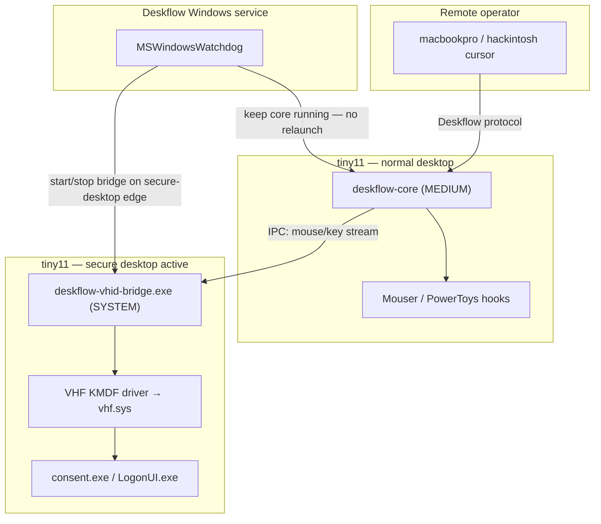

# Windows virtual HID injection for UAC (plan)

**Status:** Phase 1 in progress — user-mode bridge built; kernel driver source ready (requires WDK toolset to compile)  
**Goal:** drive UAC consent (`consent.exe`) and the login screen (`LogonUI.exe`)
from a remote Deskflow session **without relaunching** `deskflow-core` **at SYSTEM
integrity**.

**Target machine:** tiny11 (Windows 11 fleet node)  
**Supersedes (partially):** the auto-elevate kill/relaunch cycle in
`MSWindowsWatchdog` for secure-desktop input only — not the Deskflow service
itself.

---

## Problem statement

When a UAC prompt or the login screen appears, Windows moves input to the
**secure desktop**. The normal Deskflow injection path is software synthetic
input (`SendInput`, `SetCursorPos` in `MSWindowsKeyState`) — blocked there by
design, even from a SYSTEM token in some cases, and always fragile for
`consent.exe` (protected process).

Today's workaround (`daemon/elevate` + `MSWindowsWatchdog::secureDesktopActive()`):

1. Detect `consent.exe` or `LogonUI.exe`
2. **Kill** the running `deskflow-core`
3. **Relaunch** it as SYSTEM on the secure desktop
4. Reverse when the secure desktop clears

That makes UAC/login clickable, but **drops TCP/coordination peers** and forces
the core to **medium ↔ SYSTEM** flaps — disruptive to macOS/hackintosh mesh
epochs. Debounce/backoff (1.5s, exponential retry) reduces churn but does not
remove the architectural cost.

---


## Elevation split — what needs privilege and what does not

The VHF approach **moves elevation off** `deskflow-core`, not off the machine.
Something privileged still runs — it is just a small, secure-desktop-only
bridge instead of the whole KVM mesh process.


| Component                     | Integrity today (auto-elevate)                | With VHF bridge (target)                         | Why                                                                       |
| ----------------------------- | --------------------------------------------- | ------------------------------------------------ | ------------------------------------------------------------------------- |
| `deskflow-core`               | MEDIUM normally; **SYSTEM** on secure desktop | **Always MEDIUM** (user session)                 | Keeps Mouser/PowerToys hooks, stable TCP/coordination mesh                |
| `deskflow-daemon` **service** | SYSTEM (unchanged)                            | SYSTEM (unchanged)                               | Arms config at boot, manages child processes, persists settings           |
| `deskflow-vhid-bridge.exe`    | N/A                                           | **SYSTEM service** (secure desktop only)         | Feeds HID reports to the kernel driver while UAC/login is active          |
| **VHF kernel driver**         | N/A                                           | **Kernel (signed KMDF client of** `vhf.sys`**)** | Exposes virtual keyboard + mouse through the in-box HID stack             |
| **UIAccess manifest on core** | Granted when elevated                         | **Not required for UAC**                         | UIAccess helps some elevated windows; it does **not** reach `consent.exe` |


### Key insight

Physical USB keyboard/mouse work on the UAC dialog without the user's apps
running elevated. VHF aims to inject through that **same HID stack**, not through
`SendInput`. Therefore:

- `deskflow-core` **does not need elevation for UAC** once the bridge is proven.
- **The bridge + driver still need install-time admin and runtime SYSTEM** —
analogous to AnyDesk's service or the macOS `deskflow-vhid-bridge` LaunchDaemon.


### macOS analogue (already shipped)

```
deskflow-core (user)          deskflow-vhid-bridge (root LaunchDaemon)
       │                              │
       │  normal KVM path             │  Karabiner DriverKit virtual HID
       ▼                              ▼
  normal desktop                 login window / secure context
```

See `src/apps/deskflow-vhid-bridge/deskflow-vhid-bridge.cpp` and
`src/lib/gui/LoginBridgeManager.cpp`.

---


## Target architecture (Windows)




### Data flow while UAC is up

1. Remote input arrives at `deskflow-core` (still connected to mesh).
2. Core detects secure desktop (existing signal or IPC from watchdog) and
  **duplicates** mouse/key events to the bridge over a local IPC channel
   (named pipe or loopback socket — same role as macOS bridge reading the
   protocol stream).
3. `deskflow-vhid-bridge` translates Deskflow mouse/key messages into HID
  reports and submits them via `VhfSubmitReport` (or equivalent) to the
   kernel driver.
4. Windows delivers input as **hardware-class HID** to the secure desktop.
5. When secure desktop clears, watchdog **stops the bridge**; core continues
  injecting via `SendInput` on the normal desktop.


### What stays on the normal path


| Input type                          | Normal desktop                    | Secure desktop (UAC / login)                                                         |
| ----------------------------------- | --------------------------------- | ------------------------------------------------------------------------------------ |
| Pointer, buttons, scroll, keyboard  | `deskflow-core` → `SendInput`     | **VHF bridge** → virtual HID                                                         |
| Logi HID++ gestures (Mouser bridge) | Mouser → DMSR relay               | **Unchanged problem** — separate from UAC pointer; may still need host-side handling |
| Logi vendor seize (HID passthrough) | `WinHidGrabber` when focus remote | Not applicable on secure desktop                                                     |


---


## Comparison: three approaches


|                                    | Auto-elevate core (today) | VHF bridge (target)       | UIAccess only |
| ---------------------------------- | ------------------------- | ------------------------- | ------------- |
| UAC clickable                      | Yes (after relaunch)      | Should be yes (unproven)  | **No**        |
| Login screen                       | Yes                       | Should be yes             | No            |
| Mesh stable on UAC flicker         | Noisy (debounce helps)    | **Yes** — core never dies | N/A           |
| Mouser/PowerToys on normal desktop | Yes (medium core)         | **Yes**                   | Yes           |
| Signed kernel driver required      | No                        | **Yes**                   | No            |
| Core relaunch on UAC               | **Yes**                   | **No**                    | N/A           |


---


## Implementation phases


### Phase 0 — done (stability)

- [x] Debounce secure-desktop transitions (1.5s) in `MSWindowsWatchdog`
- [x] Exponential backoff on start failures

- Keeps the current auto-elevate path usable while VHF is built


### Phase 1 — proof of concept (kernel + bridge, no Deskflow integration)

**Status (2026-06-30):**


| Artifact                 | Path                                                              | Build status                                                   |
| ------------------------ | ----------------------------------------------------------------- | -------------------------------------------------------------- |
| KMDF + VHF driver source | `src/driver/deskflow-vhid/`                                       | Needs **WindowsKernelModeDriver10.0** toolset (full WDK in VS) |
| User-mode bridge         | `src/apps/deskflow-vhid-bridge-win/` → `deskflow-vhid-bridge.exe` | **Built** (`build/bin/Release/`)                               |
| Driver build script      | `scripts/build-vhid-driver.ps1`                                   | Runs MSBuild on driver vcxproj                                 |
| Driver install script    | `scripts/install-vhid-driver.ps1`                                 | `pnputil` + test-signing notes                                 |


**Deliverable:** standalone test harness that clicks a UAC **Yes** button from
a remote script while `deskflow-core` is **not** elevated.

1. **KMDF VHF client driver** (`deskflow-vhid.sys`)
  - Link against Virtual HID Framework (`vhf.h`)
  - Expose one virtual keyboard + one virtual mouse (or composite)
  - Accept HID reports from user-mode via IOCTL or VHF callback pattern
  - Sign with the same Authenticode cert used for Deskflow (WHQL optional later)
2. `deskflow-vhid-bridge.exe` (minimal)
  - Install as a child of the existing **Deskflow Windows service** or a
   dedicated `DeskflowVhid` service (SYSTEM, manual/auto start)
  - Load/communicate with the driver
  - Accept simple test input (e.g. stdin or pipe: `move dx,dy`, `click`, `key`)
  - Submit HID reports
3. **Validation on tiny11**
  - Trigger UAC (`runas` or installer)
  - Confirm virtual HID moves cursor and clicks **Yes/No** on `consent.exe`
  - Confirm physical mouse still works (no filter-driver globbing)
  - Document failure modes if secure desktop ignores VHF (rollback to Phase 0)

**Exit criterion:** recorded screen capture + log showing UAC dismissed via VHF
while `deskflow-core` stays medium.

**Build (tiny11):**

```powershell
# User-mode bridge (works now)
cmake --build build --config Release --target deskflow-vhid-bridge

# Kernel driver (requires Visual Studio + WDK with Kernel Mode Driver toolset)
.\scripts\build-vhid-driver.ps1
.\scripts\install-vhid-driver.ps1   # admin; may need bcdedit /set testsigning on

# Test bridge (driver must be loaded)
build\bin\Release\deskflow-vhid-bridge.exe test
# commands: move 10 0 | click | key 40 down / key 40 up
```


### Phase 2 — Deskflow protocol integration

**Deliverable:** bridge replays real Deskflow mouse/key stream (mirror macOS
`deskflow-vhid-bridge.cpp` scope).

1. New app: `src/apps/deskflow-vhid-bridge-win/` (or extend with `#ifdef _WIN32`)
2. IPC from `deskflow-core`:
  - Option A: core opens a named pipe to the bridge when secure desktop active
  - Option B: bridge connects to core's existing IPC (reuse `CoreIpc` patterns)
3. Translate `kMsgDMouse*` / `kMsgDKey*` (or a slim binary framing) → HID reports
4. Relative motion only on secure desktop (match macOS bridge — operator
  self-corrects visually)

**Exit criterion:** full remote KVM session on tiny11; lock screen + UAC
clickable; mesh epoch count stable across UAC open/close.

### Phase 3 — watchdog + settings integration

**Deliverable:** production path gated behind a setting; auto-elevate becomes
optional for secure-desktop input.

1. **New setting:** `daemon/vhidBridgeEnabled` (default `false` until proven)
2. `MSWindowsWatchdog` **changes:**
  - When `vhidBridgeEnabled && secureDesktopActive()` → **start bridge**, do
   **not** relaunch core elevated
  - When `vhidBridgeEnabled && !secureDesktopActive()` → stop bridge
  - When `!vhidBridgeEnabled` → keep current auto-elevate behaviour
3. **GUI:** Advanced tab toggle (mirror macOS Login Bridge manager)
4. **Installer:** register driver + bridge binary; service dependency on
  `Deskflow` service

**Migration for tiny11 fleet:**

```ini
[daemon]
elevate=true                    # keep for now OR
vhidBridgeEnabled=true          # new: prefer VHF over core relaunch
```

Once VHF is verified, `elevate` can mean "login-screen fallback only" or be
deprecated in favour of `vhidBridgeEnabled` for all secure-desktop input.

### Phase 4 — polish

- Driver install/uninstall in `scripts/install-windows.ps1`
- Bridge logging (`C:\ProgramData\Deskflow\vhid-bridge.log`)
- Health check in GUI / tray ("VHF bridge active — secure desktop")
- CI: driver build on Windows VM (no signing in CI; sign at release)

---


## Open questions (must answer in Phase 1)

1. **Does VHF virtual HID reach** `consent.exe` **on the secure desktop?**
  Hypothesis: yes (same class as physical HID). Empirical proof required.
2. **Session 0 vs Session 1:** bridge runs in the user session (Session 1)
  as SYSTEM — same model as current watchdog. Confirm driver context.
3. **Driver signing:** test-signing on tiny11 for dev; production needs
  Authenticode (existing Mariner cert?) or WHQL for broad trust.
4. **Coexistence with Karabiner-style composite device:** one virtual KB + mouse
  or composite HID — match what login/UAC expects.
5. **Mouser on secure desktop:** out of scope for VHF v1; gestures still dead
  on UAC — acceptable (pointer + keyboard is the goal).

---


## Settings matrix (future)


| Setting                         | Normal desktop | Secure desktop (VHF on)                  | Secure desktop (VHF off)              |
| ------------------------------- | -------------- | ---------------------------------------- | ------------------------------------- |
| `daemon/elevate=false`          | Medium core    | No UAC/login control                     | No UAC/login control                  |
| `daemon/elevate=true` (today)   | Medium core    | **SYSTEM core relaunch**                 | Same                                  |
| `daemon/vhidBridgeEnabled=true` | Medium core    | **VHF bridge SYSTEM**, core stays medium | Falls back to elevate if bridge fails |


Recommended fleet config once proven:

```ini
[daemon]
elevate=false
vhidBridgeEnabled=true
```

Keep `elevate=true` as fallback until Phase 1 exit criterion passes.

---


## Non-goals

- Disabling UAC (`EnableLUA=0`, `ConsentPromptBehaviorAdmin=0`) — tested,
insufficient or unsafe (`docs/plan/2026-06-26-feat-overcome-windows-uac-over-deskflow-plan.md`)
- Replacing normal-desktop `SendInput` with VHF (unnecessary; breaks nothing)
- Logi HID++ passthrough on secure desktop (separate feature;
`docs/hid-passthrough.md`)
- Filter driver that hides the physical mouse from the OS

---


## Recommendation summary


| Horizon       | Action                                                                        |
| ------------- | ----------------------------------------------------------------------------- |
| **Now**       | Keep watchdog debounce/backoff; keep `daemon/elevate=true` on tiny11          |
| **Phase 1**   | Build signed VHF driver + test bridge; prove UAC click without elevated core  |
| **Phase 2–3** | Wire Deskflow protocol; add `daemon/vhidBridgeEnabled`; stop relaunching core |
| **Do not**    | Weaken global UAC policy                                                      |


---


## References

- [Virtual HID Framework (VHF)](https://learn.microsoft.com/en-us/windows-hardware/drivers/hid/virtual-hid-framework--vhf-)
- macOS bridge: `src/apps/deskflow-vhid-bridge/deskflow-vhid-bridge.cpp`
- macOS GUI manager: `src/lib/gui/LoginBridgeManager.cpp`
- Current watchdog: `src/lib/platform/MSWindowsWatchdog.cpp` (`secureDesktopActive()`, `startProcess()`)
- UAC investigation record: `docs/plan/2026-06-26-feat-overcome-windows-uac-over-deskflow-plan.md`
  - Host HID passthrough (vendor reports, unrelated to UAC pointer):
  `docs/hid-passthrough.md`, `src/lib/server/WinHidGrabber.cpp`

