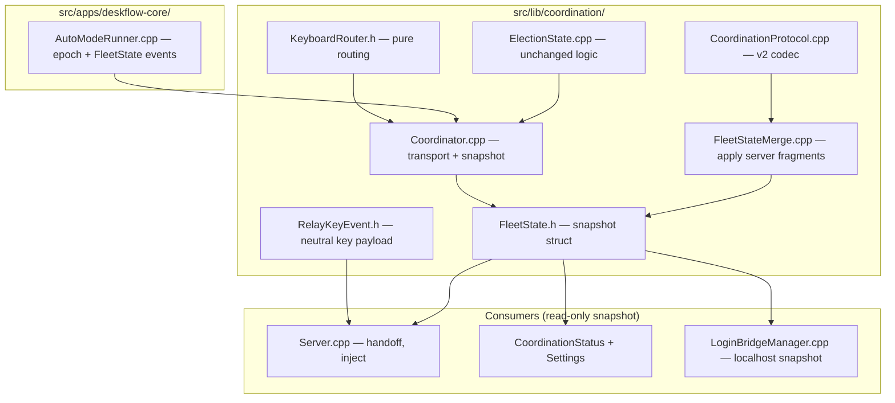
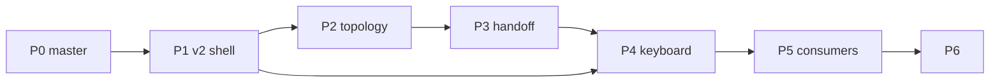

---
vgv_next:
  skill: build
  artifact: docs/plan/2026-07-02-refactor-fleet-state-hub-mesh-v2-plan.md
title: refactor fleet state hub mesh v2
type: refactor
date: 2026-07-02
---

## refactor fleet state hub mesh v2 — Extensive

## Overview

Redesign Deskflow's multi-machine KVM so the fleet behaves like **one linked desk**: link machines once, first edge cross hands off immediately, and typing on any machine appears on whichever host holds the cursor — without repeated screen slams or a manual mouse move to "wake up" sync.

This plan implements the **FleetState hub** from [`docs/brainstorm/2026-07-02-fleet-state-hub-mesh-v2-refactor-brainstorm-doc.md`](../brainstorm/2026-07-02-fleet-state-hub-mesh-v2-refactor-brainstorm-doc.md), incorporating [`docs/code-review/plan-technical-review-fleet-state-hub-2026-07-02.md`](../code-review/plan-technical-review-fleet-state-hub-2026-07-02.md).

**Supersedes (partially):** [`2026-06-30-fix-fleet-keyboard-handoff-still-failing-plan.md`](2026-06-30-fix-fleet-keyboard-handoff-still-failing-plan.md) — P0/P4 carry forward keyboard fixes; full mesh v2 refactor replaces ad-hoc `keyfwd` / dual cursor signals.

**Delivery model:** 7 stacked PRs (P0–P6). **P0 ships to `master` first.** P1–P6 on a `refactor/fleet-state-hub` branch. Hard production cutover (P6) only after soak on hackintosh + macbookpro + tiny11.

## Problem Statement / Motivation

| Observed | Expected |
|----------|----------|
| Must press screen edge repeatedly before KVM connects | First edge cross to a linked neighbor succeeds immediately |
| Keyboard only works after moving mouse to cursor host | Any keyboard types on cursor host without mouse wake-up |
| Each machine has partial topology/cursor truth | Fleet shares one topology + cursor model |
| Login bridge, Mouser, UAC use separate peer lists | All features read the same cursor + topology |

### Root cause (three partial truths today)

| Truth | Location | Gap |
|-------|----------|-----|
| KVM topology | Server-only `Config` links (`ServerConfig.cpp` → `internalConfig`) | Clients don't know adjacency; `getNeighbor` skips unconnected screens |
| Fleet cursor | Deskflow `enter`/`leave` + mesh `cursor` host name | Dual signals; no `adoptClient` enter resync |
| Election | Mesh v1 (`claim`/`promote`/`status`) | No topology or unified cursor state |

## Key design decisions (resolved for this plan)

| Decision | Choice | Notes |
|----------|--------|-------|
| Topology v1 | **Server-authoritative broadcast** | Elected server publishes `links[]` + `screens[]` from its `Config`; peers consume. Peer-merge deferred to v1.1 unless multi-editor layout is required. |
| Mesh protocol | **Additive v2 messages on port 24851** | `hello`, `fleet`, `key` alongside legacy during dev; hard cut in P6 |
| FleetState v1 schema | `peers[]`, `links[]`, `screens[]`, `cursor.{host,screen}`, `server` | No `capabilities[]`, no `cursor.pos` in v1 |
| Election | **Keep `ElectionState` separate** (Option A) | Gossip publishes role into FleetState; don't rewrite election tests |
| Keyboard | **Cursor-host inject** | Single `KeyboardRouter`; mesh `key` → cursor host synthesizes |
| Mouse stream | **Deskflow TCP 24800 unchanged** | Mesh carries state + key events only |

## Target architecture



### Consumer contract (must land in P1)

```cpp
// src/lib/coordination/FleetState.h — no KeyTypes, no Qt in merge layer
struct FleetState {
  std::string server;
  std::string cursorHost;
  std::string cursorScreen;
  // links[], screens[], peers[] ...
};

// src/lib/coordination/Coordinator.h
FleetState fleetSnapshot() const;  // mutex-guarded copy

// src/lib/base/EventTypes.h — new events
// CoordinationFleetStateChanged, CoordinationTopologyReady
```

**Layer rule:** `server/` must not `#include "coordination/CoordinationProtocol.h"`. Use `RelayKeyEvent` + events.

### Localhost snapshot (P5 login bridge)

Extend coordination status reply (or add `t: fleet_snapshot`) on `127.0.0.1:24851` so `deskflow-vhid-bridge` and `CoordinationStatus` read FleetState without linking `coordination` library.

---

## Phase P0 — Interim hotfixes (mesh v1, ship to `master`)

**Goal:** Immediate edge-slam relief before v2 branch diverges.  
**Branch:** `master` (or short-lived PR from current branch)  
**PR title:** `fix(fleet): adoptClient resync, pre-connect, switch-gating audit`

### P0 tasks

| ID | File(s) | Task |
|----|---------|------|
| P0.1 | `src/lib/server/Server.cpp` | In `adoptClient()`, if `getName(client) == getName(m_active)`, call `m_active->enter(m_x, m_y, m_seqNum, ...)` (mirror `switchScreen`) |
| P0.2 | `src/lib/deskflow/ClientApp.cpp` or client connect path | Pre-connect TCP to server for all configured layout peers at client epoch start |
| P0.3 | `src/lib/server/Server.cpp` | When `mapToNeighbor` finds configured but disconnected neighbor, queue switch on `ServerConnected` / `ScreenConnected` |
| P0.4 | `src/lib/common/Settings.cpp` | Audit defaults: document or disable `enableSwitchDelay`, `enableSwitchDoubleTap`, jump zone friction for fleet use |
| P0.5 | `src/unittests/server/ServerTests.cpp` (new or extend) | Test adoptClient enter resync when active screen matches connected client |

### P0 acceptance criteria

- [ ] First edge cross succeeds within **≤1 attempt** on 3-machine soak (baseline; tune threshold after measure)
- [ ] Reconnect while cursor on remote screen: keyboard works without mouse move (pairs with existing keyboard fixes on branch)
- [ ] **Go/no-go gate:** soak 1–2 weeks on master; document whether v2 branch is still required or P0 sufficient

### P0 supersession note

Items from [`2026-06-30-fix-fleet-keyboard-handoff-still-failing-plan.md`](2026-06-30-fix-fleet-keyboard-handoff-still-failing-plan.md) (`injectForwardedKey`, relay gating) should land on `master` **before or with P0** if not already merged.

---

## Phase P1 — Mesh v2 shell + FleetState

**Goal:** Protocol foundation; dev-only v2 mode.  
**Branch:** `refactor/fleet-state-hub`  
**PR title:** `feat(coordination): mesh v2 shell, FleetState, merge engine`

### P1 tasks

| ID | File(s) | Task |
|----|---------|------|
| P1.1 | `src/lib/coordination/FleetState.h` | Snapshot struct (v1 schema) |
| P1.2 | `src/lib/coordination/FleetStateMerge.cpp`, `.h` | Pure `applyServerFragment()` — server topology authoritative |
| P1.3 | `src/lib/coordination/CoordinationProtocol.cpp` | Encode/decode `hello` (v2), `fleet` (topology + cursor fragment) |
| P1.4 | `src/lib/coordination/Coordinator.cpp` | Maintain `m_fleetState`; `fleetSnapshot()`; post `CoordinationFleetStateChanged` |
| P1.5 | `src/lib/common/Settings.h`, `Settings.cpp` | `coordination/meshVersion` (default 1; dev flag for 2) |
| P1.6 | `src/unittests/coordination/FleetStateMergeTests.cpp` | Merge tests: empty, single server fragment, cursor update ordering |
| P1.7 | `src/unittests/coordination/CoordinationProtocolTests.cpp` | v2 round-trip tests |
| P1.8 | `docs/coordination/behavior-spec.md` | Document v2 `fleet` message schema |

### P1 acceptance criteria

- [ ] Unit tests pass: `FleetStateMergeTests`, v2 protocol tests
- [ ] Dev mode: v2 hello + fleet fragment merges into snapshot
- [ ] Production default remains mesh v1 (no behavior change)

---

## Phase P2 — Topology broadcast + GUI fleet graph

**Goal:** Fleet-wide topology visible; server publishes on promotion and layout change.  
**PR title:** `feat(fleet): server topology broadcast and GUI fleet graph`

### P2 tasks

| ID | File(s) | Task |
|----|---------|------|
| P2.1 | `src/lib/coordination/Coordinator.cpp` | On server promotion + layout change, broadcast `fleet` fragment with `links[]`, `screens[]` |
| P2.2 | `src/lib/deskflow/ServerApp.cpp` | Hook layout save → coordinator topology publish |
| P2.3 | `src/lib/gui/CoordinationStatus.cpp` | Display fleet graph from `fleetSnapshot()` |
| P2.4 | `src/lib/gui/MainWindow.cpp` | On grid edit (server epoch), trigger topology republish |
| P2.5 | `src/unittests/coordination/FleetStateMergeTests.cpp` | Server fragment replaces stale links; non-server cannot override |

### P2 acceptance criteria

- [ ] All three soak machines show **identical** topology within **≤3 s** of layout change
- [ ] Non-server peers display read-only fleet graph in status UI

---

## Phase P3 — Handoff integration

**Goal:** First edge cross uses FleetState; pre-connect; queued switch.  
**PR title:** `feat(server): FleetState topology for edge handoff`

### P3 tasks

| ID | File(s) | Task |
|----|---------|------|
| P3.1 | `src/apps/deskflow-core/AutoModeRunner.cpp` | On `CoordinationTopologyReady`, trigger client pre-connect from `fleetSnapshot().links` |
| P3.2 | `src/lib/server/Server.cpp` | Edge neighbor lookup reads FleetState links (injected via `ServerApp`, not direct coordination include) |
| P3.3 | `src/lib/server/Server.cpp` | Queued switch when neighbor configured but disconnected (extends P0.3) |
| P3.4 | `src/lib/deskflow/ServerApp.cpp` | On `switchScreen`, update `Coordinator` cursor fields; stop standalone `broadcastCursor` mesh message |
| P3.5 | `src/lib/client/Client.cpp` | enter/leave continues to update local cursor screen name in coordinator |
| P3.6 | `src/unittests/server/ServerTests.cpp` | FleetState neighbor lookup; queued switch fires on connect |

### P3 acceptance criteria

- [ ] First edge cross to each linked neighbor: **≤1 attempt**, **≤500 ms** (baseline)
- [ ] Neighbor offline at edge → handoff within **≤2 s** of neighbor online
- [ ] Server reads **only** FleetState links (no silent `Config` fallback after cutover flag)
- [ ] **Soak gate:** handoff matrix passes before P4 merge

---

## Phase P4 — Unified keyboard router

**Goal:** Single cursor-host inject path; 4×4 keyboard matrix.  
**PR title:** `feat(keyboard): unified cursor-host inject via FleetState`

### P4 tasks

| ID | File(s) | Task |
|----|---------|------|
| P4.1 | `src/lib/coordination/RelayKeyEvent.h` | Neutral key event (no `CoordinationProtocol` in server) |
| P4.2 | `src/lib/coordination/KeyboardRouter.h`, `.cpp` | Pure: `route(key, fleetSnapshot, selfName) → local | forward(host)` |
| P4.3 | `src/lib/coordination/CoordinationProtocol.cpp` | Mesh v2 `key` message |
| P4.4 | `src/lib/coordination/Coordinator.cpp` | Replace `keyfwd` + `KeyboardRelayDecision` cursorHere gate with `KeyboardRouter` + `fleetSnapshot().cursorHost` |
| P4.5 | `src/lib/server/Server.cpp`, `PrimaryClient.cpp` | `injectForwardedKey(RelayKeyEvent)`; remove `#include CoordinationProtocol.h` |
| P4.6 | `src/lib/server/Server.cpp` | Server epoch: route local KeyState through same router semantics |
| P4.7 | `src/unittests/coordination/KeyboardRouterTests.cpp` | 4×4 matrix: {server, client epoch} × {cursor local, remote} × {type on each machine} |
| P4.8 | Remove dead paths | Deprecate `m_fleetCursorHost`, standalone mesh `cursor`, dual relay branching |

### P4 acceptance criteria (4×4 matrix)

For hackintosh, macbookpro, tiny11 — type on machine **A** with cursor on host **H**:

| Cursor on | Type on | Expected |
|-----------|---------|----------|
| Server local | Slave | Text on server |
| Server local | Server | Text on server |
| Remote B | Slave A | Text on B |
| Remote B | Server | Text on B |

- [ ] All 12 directed cases pass (3 machines × 4 scenarios)
- [ ] Modifier combos (⌘C, Ctrl+Alt+Del on Windows) work on cursor host
- [ ] After role flip: matrix passes within **≤5 s** of promotion settling
- [ ] Input Monitoring denied → status UI shows actionable warning
- [ ] **Soak gate:** keyboard matrix before P5

---

## Phase P5 — Capability consumers

**Goal:** Login bridge, Mouser/HID, Windows UAC read FleetState snapshot.  
**PR title:** `feat(fleet): login bridge, Mouser, UAC consume FleetState`

### P5 tasks

| ID | File(s) | Task |
|----|---------|------|
| P5.1 | `src/lib/coordination/Coordinator.cpp` | Extend localhost status with `fleet_snapshot` JSON |
| P5.2 | `src/lib/gui/LoginBridgeManager.cpp` | Server candidates from snapshot peers + cursor host; drop static-only peer parsing where snapshot available |
| P5.3 | `src/apps/deskflow-vhid-bridge/deskflow-vhid-bridge.cpp` | Read server candidates from snapshot HTTP/TCP poll (or document plist regen from GUI only until bridge poll lands) |
| P5.4 | Mouser/HID paths | Virtual host attach when `cursorHost != self` (grep `VirtualHostTracker`, `HidConsumer`) |
| P5.5 | `src/lib/platform/MSWindowsWatchdog.cpp` | Secure-desktop elevation keyed off cursor host capability (extend existing pattern) |
| P5.6 | Platform-specific tests / manual soak scripts | Per-consumer checklist |

### P5 acceptance criteria

- [ ] Login-window control from elected server after logout (hackintosh)
- [ ] Mouser gesture on remote cursor host without manual re-enter
- [ ] Windows UAC prompt clickable from remote (tiny11)
- [ ] Each consumer reads snapshot only — **no new mesh message types**

---

## Phase P6 — Production cutover

**Goal:** Disable mesh v1; fleet upgrade; kvmctl v2.  
**PR title:** `feat(fleet): mesh v2 production cutover`

### P6 tasks

| ID | File(s) | Task |
|----|---------|------|
| P6.1 | `src/lib/coordination/CoordinationMesh.cpp` | Reject v1 peers when `coordination/meshVersion=2` |
| P6.2 | Remove legacy `cursor`, `keyfwd` handlers | After soak |
| P6.3 | kvmctl / docs | `kvmctl status` reads fleet snapshot |
| P6.4 | `docs/coordination/migration.md` | v2 upgrade runbook |
| P6.5 | Settings default | `coordination/meshVersion=2` |

### P6 acceptance criteria

- [ ] All soak machines on v2 before any machine disables v1
- [ ] Mixed-version machine shows **version mismatch** in GUI (not silent partial fleet)
- [ ] `kvmctl` snapshot matches GUI fleet graph

---

## Dependencies



| Phase | Depends on | Merge gate |
|-------|------------|------------|
| P0 | — | Unit tests + 1–2 week soak |
| P1 | — | Merge + unit tests |
| P2 | P1 | Topology UI soak |
| P3 | P2 | Handoff soak |
| P4 | P1, P3 | 4×4 keyboard matrix |
| P5 | P4 | Login/Mouser/UAC soak |
| P6 | P1–P5 | Coordinated fleet upgrade |

---

## Risks and mitigations

| Risk | Mitigation |
|------|------------|
| Long v2 branch | P0 on master; weekly rebase; phase gates |
| Dual topology (Config vs FleetState) | P3 cutover flag; tests assert single source |
| Keyboard latency over mesh | Small JSON keys only; mouse stays TCP 24800 |
| vhid-bridge can't link coordination | Localhost snapshot (P5.1) |
| Scope creep in P5 | Split P5a/P5b/P5c if > ~800 LOC |

---

## Testing strategy

| Layer | Tooling |
|-------|---------|
| Pure merge/router | `FleetStateMergeTests`, `KeyboardRouterTests`, `CoordinationProtocolTests` |
| Server handoff | `ServerTests` (adoptClient, queued switch) |
| Integration | 3-machine manual soak (hackintosh, macbookpro, tiny11) |
| CI | All unit tests every PR; soak gates manual between phases |

---

## Related artifacts

| Doc | Role |
|-----|------|
| [`docs/brainstorm/2026-07-02-fleet-state-hub-mesh-v2-refactor-brainstorm-doc.md`](../brainstorm/2026-07-02-fleet-state-hub-mesh-v2-refactor-brainstorm-doc.md) | Origin decisions |
| [`docs/code-review/plan-technical-review-fleet-state-hub-2026-07-02.md`](../code-review/plan-technical-review-fleet-state-hub-2026-07-02.md) | Review findings |
| [`docs/coordination/design.md`](../coordination/design.md) | Current epoch loop |
| [`docs/coordination/behavior-spec.md`](../coordination/behavior-spec.md) | Election semantics to preserve |

---

## Full soak checklist (pre-P6)

- [ ] Link three machines once; identical topology in status UI
- [ ] First edge cross without repeated slam
- [ ] 4×4 keyboard matrix passes
- [ ] Role flip → handoff within one edge cross after epoch settles
- [ ] Reconnect / sleep-wake → resync within 10 s
- [ ] Login bridge, Mouser, UAC (P5)
- [ ] Version mismatch visible for straggler machine
