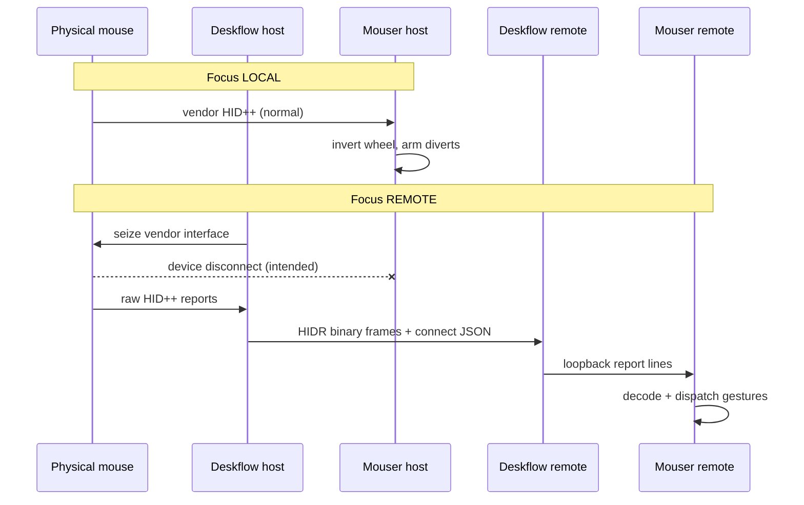

# Native mouse handoff (minimal Mouser changes)

**Goal:** One physical Logitech mouse behaves natively on whichever machine has KVM
focus — gestures, thumb button, firmware scroll invert, DPI — while the host
machine does **nothing** with those vendor events when focus is remote.

**Principle:** Deskflow owns transport and host-side suppression. Mouser stays a
local HID++ consumer on each machine. No semantic relay vocabulary in Deskflow;
no double-invert; no “jank” OS-level suppression on the host.

---

## Success criteria

| Scenario | Expected behavior |
|---|---|
| Focus on host (mouse physically here) | Host Mouser owns device; wheel invert / gestures work locally |
| Focus on remote | Host Mouser **loses** vendor interface; gestures fire on remote Mouser only |
| Return focus to host | Host Mouser re-acquires device; saved settings replay |
| Deskflow crash mid-remote | OS releases seize; host Mouser recovers automatically |
| Deskflow absent / off | Mouser on every machine works exactly as today |
| Remote machine, no Mouser | Pointer still works via normal Deskflow KVM; vendor buttons simply absent |

---

## Architecture (recommended)



### Why this needs almost no Mouser work

1. **Host suppression is physical, not logical.** Deskflow’s `HidPassthrough`
   calls `kIOHIDOptionsTypeSeizeDevice` (macOS) / exclusive `CreateFile`
   (Windows) on the **vendor collection only** when focus is remote. The
   standard pointer interface is untouched (Deskflow’s normal KVM path).
   Host Mouser observes a disconnect — it cannot fire gestures because it no
   longer has the device.

2. **Remote execution reuses existing code.** `core/remote_device.py` already
   accepts `{"type":"report","data":"<hex>"}` and feeds a detached
   `HidGestureListener` — the same decode path as local hidapi reads.

3. **Mouser bridge (`remote_forward`) is the fallback**, not the default. It
   requires host-side `should_forward()` gating in `mouse_hook_base.py`. Keep
   it for debugging or platforms without a grabber; do not run it alongside
   HID passthrough (Deskflow logs a conflict warning).

---

## What is already implemented

### Deskflow (`master`)

| Component | Role |
|---|---|
| `HidPassthrough` + `OSXHidGrabber` / `WinHidGrabber` | Discover, focus-driven seize, raw report callback |
| `kMsgDHidReport` (`HIDR`) | Binary hot-path for raw frames server → client |
| `Server::updateHidVirtualHost` | Virtual device follows focus (connect/disconnect replay) |
| `MouserClient` | Re-encodes `HIDR` → `{"type":"report"}` on loopback |
| `MouserBridge` + `kMsgDMouserData` | Legacy decoded-event relay (superseded by passthrough) |
| `coordination/*` + `auto` mode | Last-touch-wins primary election (orthogonal) |
| GUI toggle | “Share device controls” in Sharing settings |

See `docs/hid-passthrough.md` for wire format and fail-safe table.

### Mouser (already merged on `working`)

| Component | Role |
|---|---|
| `core/remote_device.py` | Loopback consumer; `report` + `event` messages |
| `core/remote_forward.py` | **Fallback** host relay + `should_forward()` suppression |
| `mouse_hook_base._should_intercept_events` | Stands down OS hooks while forwarding |
| `mouse_hook_base._maybe_forward_raw_report` | Raw-frame tap at listener boundary |
| `engine.gesture_decode_context()` | Ships `feat_idx` / `gesture_cid` in bridge `connect` |
| Tests | `test_remote_raw_frames.py`, `test_remote_end_to_end.py` |

---

## Remaining work (prioritized)

### P0 — Decode context on passthrough attach (Deskflow-heavy)

**Problem:** `HidPassthrough::connectLineFor()` emits PID/name/usage but not
`decode: { feat_idx, gesture_cid, extra_diverts }`. Without `feat_idx`, remote
`remote_device` rejects raw frames (by design — guessing indexes misfires).

**Options (pick one):**

| Option | Mouser diff | Deskflow diff | Notes |
|---|---|---|---|
| **A. Decode cache from host Mouser** | ~15 lines: send `{"type":"decode",...}` to bridge while focus local | ~30 lines: `MouserBridge` caches decode; merge into `connectLineFor` | Reuses live `gesture_decode_context()`; host Mouser stays enabled but does not forward events when passthrough is on |
| **B. Deskflow HID++ probe at attach** | **0** | ~200 lines: enumerate REPROG_V4 index + read gesture CID from catalog | Pure Deskflow; duplicates a slice of `hid_gesture.py` |
| **C. Catalog-derived decode in remote_device** | ~40 lines: derive `gesture_cid` from `logi_device_catalog`; probe `feat_idx` from first matching report | 0 | Fragile for receivers / multi-interface devices |

**Recommendation:** **Option A** for v1 (smallest total risk, uses ground-truth
from the machine that armed diverts). Host config:

```json
"remote_forward": { "enabled": true, "token": "...", "passthrough_decode_only": true }
```

When `passthrough_decode_only` is set, `RemoteForwarder` connects to the
bridge, publishes decode updates, and **never** calls `send_event` /
`send_report` (Deskflow owns the byte pipe).

### P1 — Mutual exclusion polish (Deskflow)

- When `hidPassthroughEnabled`, auto-disable `mouserBridgeEnabled` in
  `Settings::cleanSettings` or refuse start with a clear GUI message.
- Tray status: `server · MX Master 4 → macbook` (name from attach descriptor).

### P2 — Linux host grabber

`StubHidGrabber` today. Implement `LinuxHidGrabber` via hidraw exclusive or
`EVIOCGRAB` on the vendor collection. Until then, Linux host can use the
**Mouser bridge fallback** (`remote_forward` + `remote_device`).

### P3 — Live soak + TCC

- macOS: ad-hoc sign `deskflow-core` once (`codesign --force --sign - --identifier com.deskflow.core`); grant Accessibility + Input Monitoring to that identity.
- Two-machine checklist below.

### P4 — `mouseflow` packaging repo (later)

Submodules (`deskflow`, `Mouser`), generated `cluster.yaml`, installers, docs.
Not blocking functional handoff.

---

## Configuration recipe (two Macs)

### Machine A — mouse physically attached (Deskflow server)

`~/Library/Application Support/Deskflow/deskflow.conf`:

```ini
[server]
hidPassthroughEnabled=true
hidPassthroughDevices=046D:B042
mouserBridgeEnabled=true
mouserBridgePort=19796
mouserBridgeToken=<shared-secret>
```

Mouser `config.json` (host):

```json
"remote_forward": {
  "enabled": true,
  "token": "<shared-secret>",
  "passthrough_decode_only": true
},
"remote_device": { "enabled": false }
```

`remote_forward` here is **decode-sync only** (after P0). Host gestures/wheel
invert work normally while focus is local.

### Machine B — remote (Deskflow client)

```ini
[client]
mouserEnabled=true
mouserPort=19795
mouserToken=<shared-secret>
```

Mouser `config.json` (remote):

```json
"remote_device": {
  "enabled": true,
  "token": "<shared-secret>"
},
"remote_forward": { "enabled": false }
```

Per-machine wheel invert / button maps are independent — no double-invert
because only one machine holds the vendor interface at a time.

---

## Fallback: Mouser bridge only (no HID seize)

Use when passthrough grabber is unavailable (Linux host) or for debugging.

- Host: `mouserBridgeEnabled=true`, `hidPassthroughEnabled=false`
- Host Mouser: `remote_forward.enabled=true` (full relay, not decode-only)
- Remote Mouser: `remote_device.enabled=true`

Suppression on host is **logical** via `should_forward()`:
`_hid_event_entry` and `_maybe_forward_raw_report` return early; OS hooks
stand down via `_should_intercept_events()`.

Trade-off: host Mouser still holds the hidapi handle — Options+ and host
divert state can race. Passthrough is cleaner.

---

## Test plan

### Unit (already present; extend)

- [ ] Deskflow: decode cache merged into connect line
- [ ] Mouser: `passthrough_decode_only` never sends events
- [ ] Mouser: raw-frame gesture swipe end-to-end with catalog-free decode handoff

### Integration (loopback)

1. Start Deskflow server with passthrough + bridge on A.
2. Start Mouser A (decode-only forwarder) + Mouser B (remote_device).
3. Connect Deskflow client B.
4. Simulate focus remote → verify host Mouser disconnect log.
5. Inject raw gesture frame via grabber test hook → verify B dispatches swipe.

### Live soak (Hackintosh + MacBook)

- [ ] Focus local: firmware wheel invert on host only
- [ ] Swipe left/right Mission Control gestures on remote only
- [ ] Return focus: host Mouser reconnects, settings replay
- [ ] Kill Deskflow mid-remote: host Mouser recovers within 2s
- [ ] Coordination `auto` mode: touch-to-promote does not break passthrough

---

## Implementation order

```
P0 decode handoff (Option A)
  → P1 mutual exclusion + tray
    → P3 live soak (macOS)
      → P2 Linux grabber
        → P4 mouseflow repo
```

**Estimated Mouser diff for P0 Option A:** one flag in config, ~10 lines in
`remote_forward.py` to skip event sends, ~5 lines to emit decode updates on
`feat_idx` change.

**Estimated Deskflow diff for P0:** cache decode in `MouserBridge`, merge into
`HidPassthrough::connectLineFor` output.

---

## Non-goals

- Teleporting pointer/clicks (Deskflow already does this)
- Kernel filter drivers / Tier-2 virtual HID reinjection (future)
- Merging Mouser into Deskflow
- Semantic `gesture_down` vocabulary in Deskflow long-term (retire after passthrough proven)
